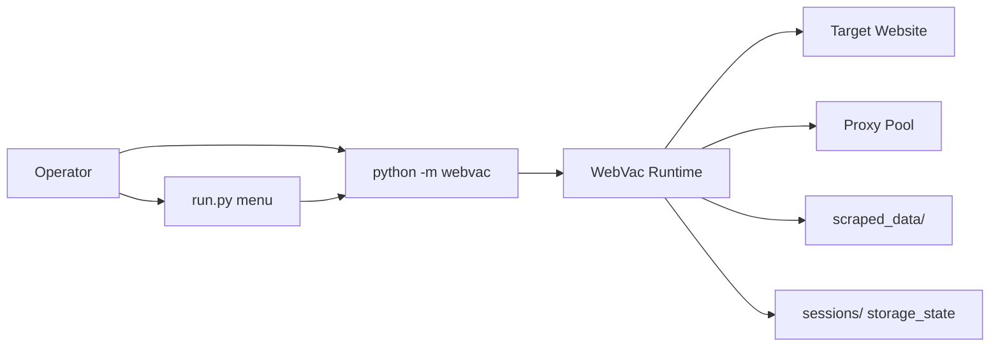
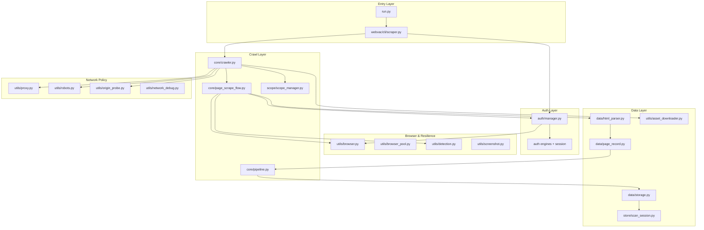
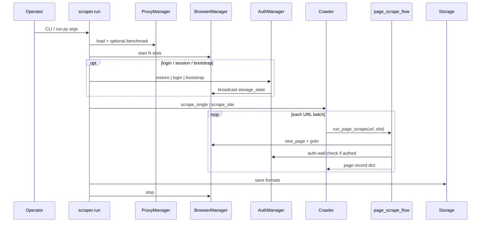
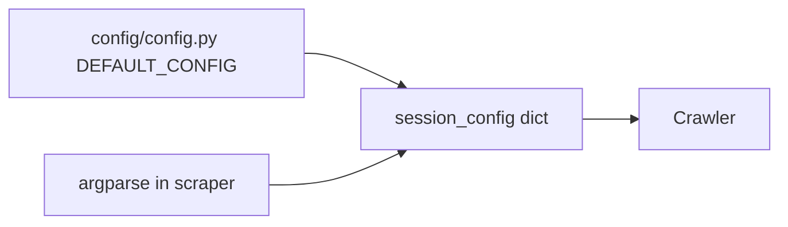
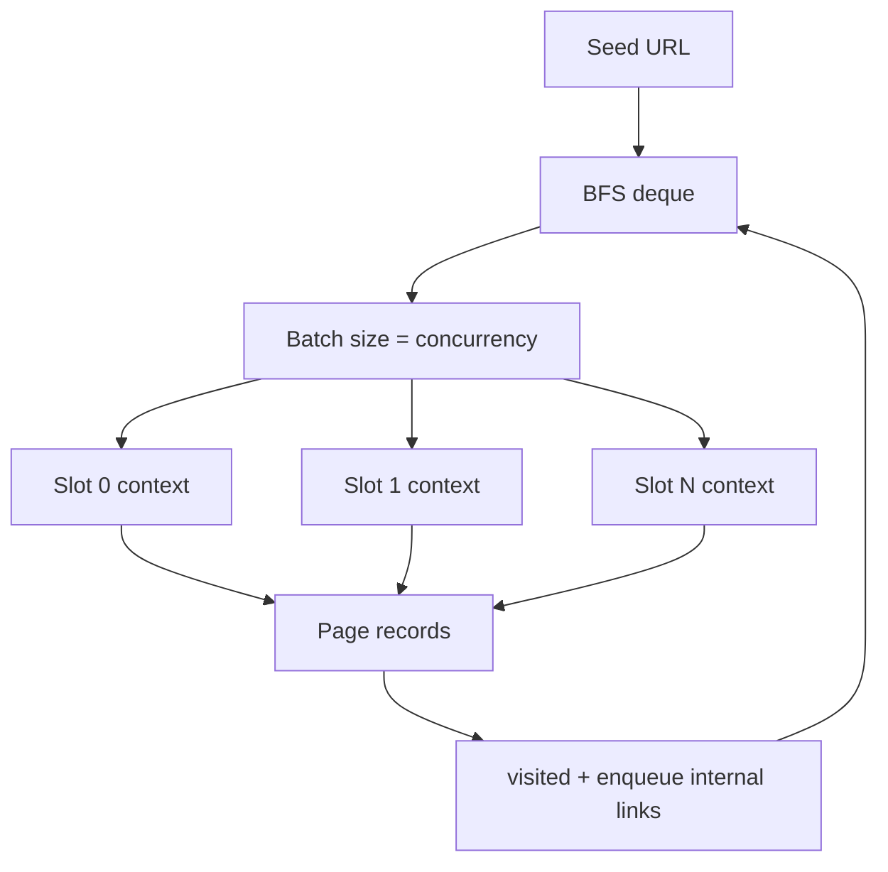

# WebVac — Full System Architecture

**Last updated:** 2026-07-27  
**Related:** [Authentication](architecture/AUTH.md) · [Crawl & Browser](architecture/CRAWL.md) · [Data & Storage](architecture/DATA.md) · [Proxy & Origin](architecture/PROXY_ORIGIN.md) · [Changelog](../CHANGELOG.md)

---

## 1. Purpose

WebVac is an **asyncio** scraper that drives real Chromium (via **Patchright**) to crawl JavaScript-heavy sites, optionally authenticate, rotate proxies, bypass CDN-to-origin when authorized, and export multi-format historical scan artifacts.

---

## 2. High-level system context



---

## 3. Layered architecture



---

## 4. End-to-end runtime sequence



---

## 5. Package map

| Package | Responsibility |
|---------|----------------|
| `run.py` | Interactive launcher → builds argv → invokes scraper |
| `core/` | CLI orchestration, BFS crawler, per-page flow, user pipelines |
| `auth/` | Login, sessions, MFA, walls, profiles |
| `utils/` | Browser pool, proxies, robots, detection, origin probe, network debug, screenshots, assets |
| `data/` | HTML parse, page records, multi-format export |
| `config/` | Defaults |
| `scope/` | Domain / depth / URL allow-deny |
| `store/` | Scan folder layout |
| `models/` | Scan metadata and typed records |
| `vapt/` | Opt-in De-Caffeinator launcher |
| `docs/` | Architecture docs |

---

## 6. Pipeline

| Pipeline | Module | Status |
|----------|--------|--------|
| **User scrape pipeline** | `core/pipeline.py` (`PipelineManager`) | **Active** — `--pipeline-file` mutates page dicts before save |

---

## 7. Configuration spine



Important defaults:

- Scrape formats: `json,csv,html`
- Crawl respects robots unless `--no-robots`
- Auth wall policy default: `skip`

---

## 8. On-disk output model

```text
scraped_data/
  <domain>_<target_id>/
    scans/
      <timestamp>_<scan_id>/
        scrape/       # data.json, data.csv, report.html, …
        network/      # failure / challenge network dumps
        assets/
          pdfs/
          sourcemaps/
          screenshots/
        meta/
          meta.json
          session.json
```

Sessions (auth) live separately under `sessions/` (gitignored).

---

## 9. Concurrency model



Each **slot** = isolated browser context with:

- Own proxy (optional)
- Own UA / Client Hints identity
- Shared auth `storage_state` after login (broadcast)

Login always uses **slot 0**; when authenticated, slot-0 proxy is pinned (no voluntary rotate).

---

## 10. Feature status matrix

| Feature | Status |
|---------|--------|
| Single-page + BFS crawl | Active |
| Concurrent browser slots | Active |
| Proxy pool + health + sticky | Active |
| Robots + delays | Active |
| AuthManager (Patchright) | Active |
| Session restore / TTL / Fernet | Active |
| Mid-crawl auth-wall policy | Active |
| Manual origin IP / Host bypass | Library-only (`session_config.origin_access`; no CLI) |
| Network debug dumps on scrape failures | Active (default on) |
| Bot detection + CAPTCHA prompt | Active |
| Multi-format export | Active |
| PDF / sourcemap download | Active |
| User `PipelineManager` | Active |
| `api_fuzzer` | Not implemented |

---

## 11. Design principles

1. **Scrape spine first** — browser crawl + page records are the core path.
2. **Auth is a facade** — engines stay swappable behind `AuthManager`.
3. **Slot isolation** — concurrency via contexts, not tabs in one profile.
4. **Additive CLI** — new flags never break existing `--login` / `--session-file`.
5. **Security gated** — invasive behaviors stay opt-in.
6. **Historical scans** — every run is a versioned session folder under the target.

---

## 12. Module architecture index

| Doc | Focus |
|-----|-------|
| [architecture/AUTH.md](architecture/AUTH.md) | Login, sessions, MFA, walls, bootstrap |
| [architecture/CRAWL.md](architecture/CRAWL.md) | Crawler, page flow, browser pool |
| [architecture/DATA.md](architecture/DATA.md) | Parse, records, storage, scan layout |
| [architecture/PROXY_ORIGIN.md](architecture/PROXY_ORIGIN.md) | Proxies, robots, manual origin IP |

Open the visual one-pager: [`webvac-architecture-one-page.html`](webvac-architecture-one-page.html).
