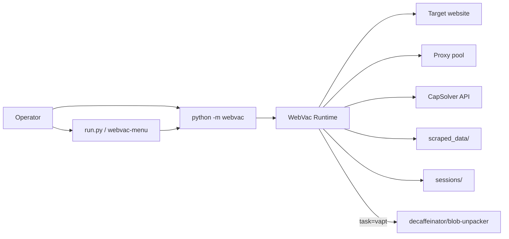
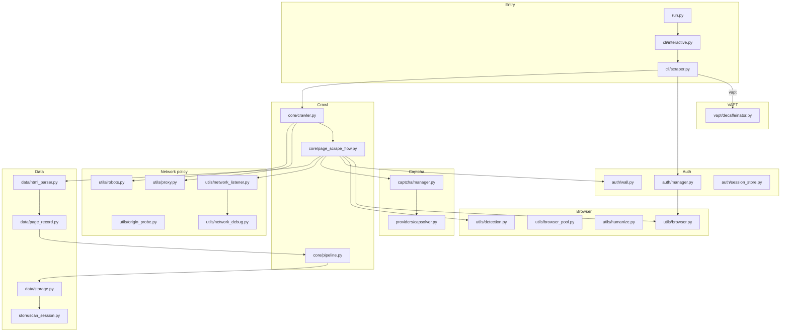
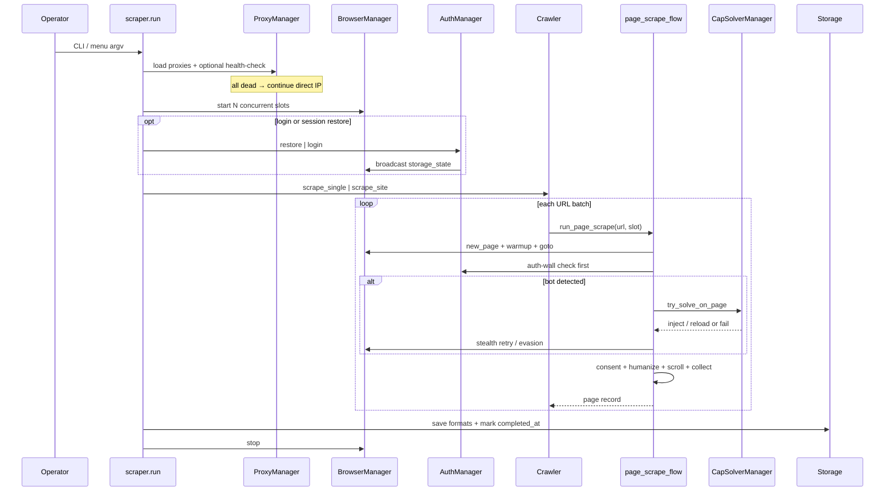
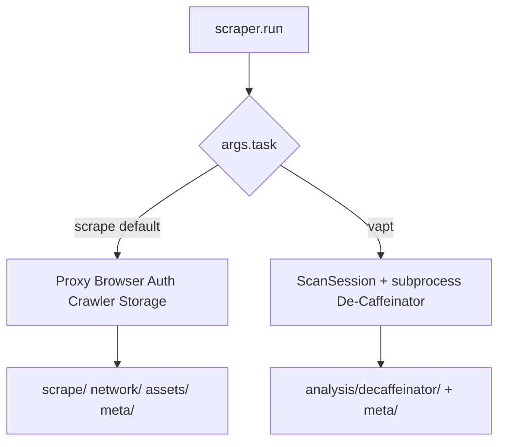
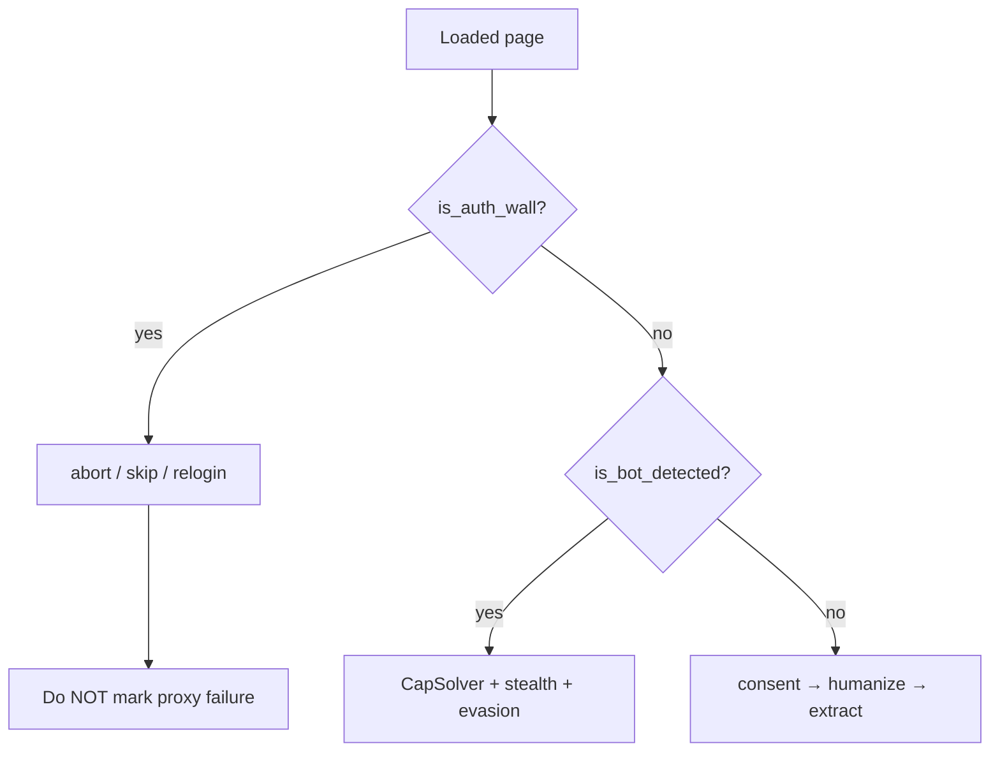

# WebVac — full system architecture

**Version:** 0.3.0  
**Related:** [Overview](OVERVIEW.md) · [Workflows](WORKFLOWS.md) · [Crawl](architecture/CRAWL.md) · [Auth](architecture/AUTH.md) · [Captcha](architecture/CAPTCHA.md) · [Proxy](architecture/PROXY_ORIGIN.md) · [Browser](architecture/BROWSER.md) · [Network](architecture/NETWORK.md) · [Data](architecture/DATA.md) · [VAPT](architecture/VAPT.md) · [Changelog](../CHANGELOG.md)

---

## 1. Purpose

WebVac is an **asyncio** scraper that drives real Chromium (via **Patchright**) to crawl JavaScript-heavy sites, optionally authenticate, rotate proxies, auto-solve widget CAPTCHAs (CapSolver), diagnose network failures, and export multi-format historical scan artifacts. An opt-in **VAPT** task shells out to De-Caffeinator for JS analysis.

---

## 2. System context



---

## 3. Layered architecture



---

## 4. End-to-end runtime sequence (scrape)



---

## 5. Task split: scrape vs VAPT



| Task | Browser crawl? | Primary output |
|------|----------------|----------------|
| `scrape` (default) | Yes | `scrape/data.json`, `report.html`, … |
| `vapt` | No (De-Caffeinator may use Playwright internally) | `analysis/decaffeinator/` |

---

## 6. Package map

| Package / path | Responsibility |
|----------------|----------------|
| `run.py` | Thin shim → interactive menu |
| `cli/scraper.py` | CLI parser, doctor, scrape/VAPT orchestration |
| `cli/interactive.py` | Menu UX → argv builder |
| `core/crawler.py` | Single / BFS crawl, session init, retries orchestration |
| `core/page_scrape_flow.py` | Per-URL goto → wall → bot → captcha → collect |
| `core/pipeline.py` | Optional user post-processing hooks |
| `auth/` | AuthManager, profiles, sessions, MFA, walls |
| `captcha/` | CapSolver detect / extract / solve / inject |
| `utils/` | Browser, proxy, robots, detection, humanize, network, screenshots, assets, consent, origin |
| `data/` | HTML parse, page records, multi-format storage |
| `store/` | Scan folder layout + `meta.json` |
| `models/` | `ScanMetadata`, `TargetMetadata`, origin models |
| `vapt/` | De-Caffeinator launcher |
| `config/` | `DEFAULT_CONFIG` |
| `decaffeinator/` | Git submodule (tool at `blob-unpacker/`) |

---

## 7. Critical separation: auth wall vs bot block



This separation is intentional and must not be collapsed. Details: [AUTH](architecture/AUTH.md) · [BROWSER](architecture/BROWSER.md).

---

## 8. Concurrency model

- One shared Chromium process.
- `concurrency = N` → N `BrowserSlot` contexts.
- Each slot can pin a different proxy + UA + optional geo/timezone identity.
- Auth login always uses **slot 0**; `storage_state` is broadcast to other slots.
- BFS takes batches of up to N URLs and `asyncio.gather`s them.

---

## 9. Artifact model

Every scrape or VAPT run creates a **scan session**:

```text
scraped_data/<domain>_<target8>/scans/<timestamp>_<scan8>/
  scrape/ | network/ | analysis/ | assets/ | meta/
```

See [SCAN_LAYOUT.md](SCAN_LAYOUT.md).

---

## 10. Status matrix (product)

| Area | Status | Notes |
|------|--------|-------|
| Dynamic crawl (Patchright) | Stable | Primary path |
| Lightweight aiohttp engine | Supported | Falls back to dynamic on bot block |
| Auth login / session / TOTP | Stable | Patchright-only |
| CapSolver widgets | Stable | Default on when key present |
| Managed CF interstitial | Partial | Detected; CapSolver usually cannot clear |
| Proxy playbooks | Stable | residential / datacenter / none |
| Network debug dumps | Stable | RUM beacons ignored |
| De-Caffeinator VAPT | Stable | Submodule required |
| In-tree VAPT analyzers | Removed | Use De-Caffeinator instead |

---

## 11. Configuration surface

Defaults live in `webvac/config/config.py`. CLI flags overlay into `session_config` inside `scraper.run`. Full map: [CONFIG_REFERENCE.md](CONFIG_REFERENCE.md).
