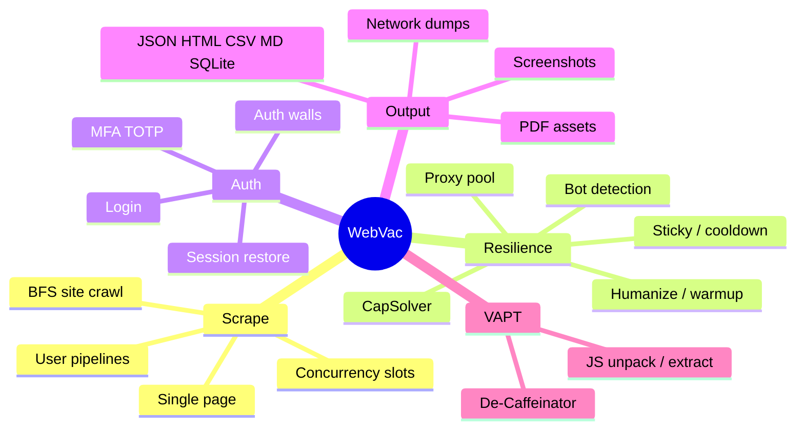
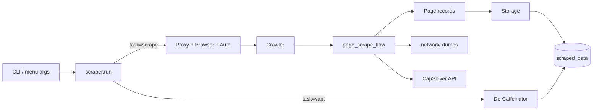

# WebVac overview

**WebVac** is an asyncio-powered **dynamic web scraper and site crawler**. It drives real Chromium through [Patchright](https://github.com/Kaliiiiiiiiii-Vinyzu/patchright) (Playwright-compatible), optionally logs in, rotates proxies, auto-solves CAPTCHAs via CapSolver, and writes rich historical scan artifacts under `scraped_data/`.

An optional second task launches **De-Caffeinator** (git submodule) for VAPT-oriented JavaScript reverse engineering — without replacing the scrape pipeline.

---

## 1. What WebVac is

| It is | It is not |
|-------|-----------|
| A real-browser crawler for JS-heavy sites | A static `requests`/`BeautifulSoup`-only scraper (lightweight mode exists but falls back to dynamic) |
| A scrape / crawl product with optional auth | A full in-tree VAPT vulnerability scanner (old in-tree VAPT stack was removed) |
| CapSolver-integrated for widget CAPTCHAs | A general Cloudflare managed-challenge breaker |
| Session-aware (storage_state, MFA/TOTP) | An OAuth hosted IdP product |
| Organized historical scan storage | A SaaS dashboard |

---

## 2. Core capabilities

---

## 3. Design principles

1. **Real browser first** — Patchright Chromium renders SPA content the way a user would.
2. **Auth walls ≠ bot blocks** — Login pages never trigger WAF retries or proxy failure marks.
3. **Fail open on dead proxies** — Unhealthy `proxies.txt` entries warn; crawl continues on real IP.
4. **CapSolver when a key exists** — Default on with `capsolver.key` / env; `--captcha-solver none` disables.
5. **Session-scoped artifacts** — Every run gets a dated folder under `scraped_data/<target>/scans/…`.
6. **Opt-in VAPT** — `--task vapt` replaces scrape for that invocation; scrape remains the default product path.
7. **Secrets stay local** — `auth_creds.json`, `proxies.txt`, `capsolver.key`, `sessions/` are gitignored.

---

## 4. Runtime entry points

| Command | Role |
|---------|------|
| `python run.py` / `webvac-menu` | Interactive menu (scrape / crawl / VAPT / scan library) |
| `python -m webvac …` / `webvac` | Full CLI orchestrator |
| `python -m webvac --doctor` | Preflight checks |

See [architecture/CLI.md](architecture/CLI.md).

---

## 5. High-level data flow

---

## 6. Subsystems at a glance

| Subsystem | Package | Doc |
|-----------|---------|-----|
| Orchestration | `cli/` | [CLI](architecture/CLI.md) |
| Crawl + page flow | `core/` | [CRAWL](architecture/CRAWL.md) |
| Browser pool / humanize | `utils/browser*.py`, `humanize.py` | [BROWSER](architecture/BROWSER.md) |
| Auth | `auth/` | [AUTH](architecture/AUTH.md) |
| CapSolver | `captcha/` | [CAPTCHA](architecture/CAPTCHA.md) |
| Proxy / robots / origin | `utils/proxy*.py`, `robots.py`, `origin_probe.py` | [PROXY_ORIGIN](architecture/PROXY_ORIGIN.md) |
| Network debug | `utils/network_*.py` | [NETWORK](architecture/NETWORK.md) |
| Parse / export | `data/`, `store/` | [DATA](architecture/DATA.md), [SCAN_LAYOUT](SCAN_LAYOUT.md) |
| VAPT | `vapt/`, `decaffeinator/` | [VAPT](architecture/VAPT.md) |
| Defaults | `config/config.py` | [CONFIG_REFERENCE](CONFIG_REFERENCE.md) |

---

## 7. Boundaries and responsible use

WebVac can interact with anti-bot systems, login forms, and origin-IP probing. Use only on targets you are authorized to test. See [SECURITY.md](SECURITY.md).

---

## 8. Version

This documentation describes **WebVac 0.3.0**.
