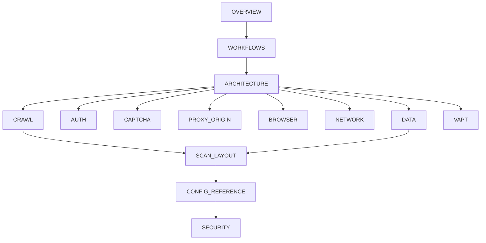

# WebVac documentation

Complete technical documentation for **WebVac** — an asyncio Patchright scraper with auth, CapSolver, proxy resilience, historical scan sessions, and an optional De-Caffeinator VAPT task.

**Start here if you are new:** [OVERVIEW.md](OVERVIEW.md) → [WORKFLOWS.md](WORKFLOWS.md) → [ARCHITECTURE.md](ARCHITECTURE.md)

**Start here for day-to-day usage:** root [`README.md`](../README.md) · [`CHANGELOG.md`](../CHANGELOG.md)

All diagrams use **Mermaid** (GitHub, VS Code Mermaid preview, or any Mermaid renderer).

---

## Documentation map

### Foundations

| Document | What it covers |
|----------|----------------|
| [OVERVIEW.md](OVERVIEW.md) | What WebVac is / is not, capabilities, design principles, threat model boundaries |
| [STRUCTURE.md](STRUCTURE.md) | Repository and `webvac/` package tree, entry points, local secrets |
| [ARCHITECTURE.md](ARCHITECTURE.md) | Layered system architecture, package map, runtime sequence, status matrix |
| [WORKFLOWS.md](WORKFLOWS.md) | End-to-end scrape, crawl, auth, CapSolver, and VAPT workflows with diagrams |

### Internal architecture (deep dives)

| Document | What it covers |
|----------|----------------|
| [architecture/CLI.md](architecture/CLI.md) | `scraper.py`, interactive menu, `--doctor`, argv construction |
| [architecture/CRAWL.md](architecture/CRAWL.md) | BFS crawler, concurrency slots, `page_scrape_flow`, retries / evasion |
| [architecture/BROWSER.md](architecture/BROWSER.md) | BrowserManager, slot pool, humanize, warmup, bot detection |
| [architecture/AUTH.md](architecture/AUTH.md) | AuthManager, sessions, MFA/TOTP, auth walls vs bot blocks |
| [architecture/CAPTCHA.md](architecture/CAPTCHA.md) | CapSolver pipeline: detect → extract → solve → inject |
| [architecture/PROXY_ORIGIN.md](architecture/PROXY_ORIGIN.md) | Proxies, playbooks, sticky/cooldown, robots, origin probe |
| [architecture/NETWORK.md](architecture/NETWORK.md) | NetworkListener, debug dumps, challenge classification |
| [architecture/DATA.md](architecture/DATA.md) | HTML parse, page records, pipelines, export formats |
| [architecture/VAPT.md](architecture/VAPT.md) | De-Caffeinator integration (`--task vapt`) |

### Reference

| Document | What it covers |
|----------|----------------|
| [SCAN_LAYOUT.md](SCAN_LAYOUT.md) | On-disk scan session layout and `meta.json` schema |
| [CONFIG_REFERENCE.md](CONFIG_REFERENCE.md) | `DEFAULT_CONFIG` knobs and CLI flag mapping |
| [SECURITY.md](SECURITY.md) | Secrets handling, responsible use, auth/proxy safety |

### Visual assets

| Asset | Description |
|-------|-------------|
| [webvac-architecture-one-page.html](webvac-architecture-one-page.html) | One-page visual architecture |
| [`scripts/generate_architecture_pdf.py`](../scripts/generate_architecture_pdf.py) | Regenerate `webvac-architecture.pdf` |

---

## Suggested reading order

---

## Version

Docs target WebVac **0.3.0** (scrape-first core + opt-in De-Caffeinator VAPT). When code and docs disagree, **trust the code** under `webvac/` and open a docs fix.
