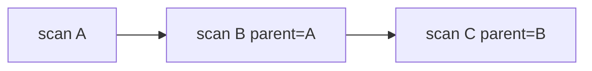

# Scan session layout

**Parent:** [DATA](architecture/DATA.md) · [ARCHITECTURE](ARCHITECTURE.md)  
**Code:** `webvac/store/scan_session.py`, `webvac/models/scan.py`

---

## 1. Directory tree

```text
{output_dir}/                                 # default: scraped_data
  {domain_slug}_{target_id[:8]}/
    scans/
      {YYYYMMDD_HHMMSS}_{scan_id[:8]}/
        scrape/
          data.json
          report.html
          data.csv            # if requested
          report.md           # if requested
          {slug}.db           # if sqlite
        network/
          {host}_{utc_ts}.json
        analysis/
          decaffeinator/      # --task vapt
        assets/
          pdfs/
          sourcemaps/
          screenshots/
        meta/
          meta.json
          decaffeinator.json  # VAPT only
```

### Identity

| Field | Derivation |
|-------|------------|
| `target_id` | SHA256 of host, truncated |
| `domain_slug` | Host lowercased, non-alnum → `-` |
| `scan_id` | UUID |
| `session_name` | `{started_at timestamp}_{scan_id[:8]}` |
| `parent_scan_id` | `--parent-scan-id` or latest prior session folder name |

Auth sessions are **not** stored here — they live in gitignored `sessions/`.

---

## 2. `meta.json` schema

| Field | Type | Meaning |
|-------|------|---------|
| `target_id` | string | Stable target hash |
| `scan_id` | string | UUID |
| `parent_scan_id` | string \| null | Prior session linkage |
| `session_name` | string | Folder basename |
| `slug` | string | Label (`url` slug or `decaffeinator`) |
| `domain` | string | Seed netloc |
| `seed_url` | string | Seed URL |
| `profile` | string | e.g. `scrape`, `decaffeinator` |
| `mode` | string | e.g. `scrape`, `vapt` |
| `started_at` | string | UTC ISO |
| `completed_at` | string \| null | UTC ISO after `ScanMetadata.mark_completed()` |
| `interrupted` | bool | Ctrl+C or VAPT non-zero exit |
| `layout` | object | Relative folder map |
| `origin_access` | object \| optional | When origin probe used |

### When `completed_at` is set

- **Scrape:** `Storage.save` → `scan.mark_completed()` → `write_meta`
- **VAPT:** after De-Caffeinator subprocess returns → `mark_completed()` → rewrite `meta.json`

---

## 3. Parent chaining



Enables historical comparison across runs for the same target folder.

---

## 4. Related

- [DATA](architecture/DATA.md) — file writers  
- [NETWORK](architecture/NETWORK.md) — network dump names  
- [VAPT](architecture/VAPT.md) — analysis subtree  
