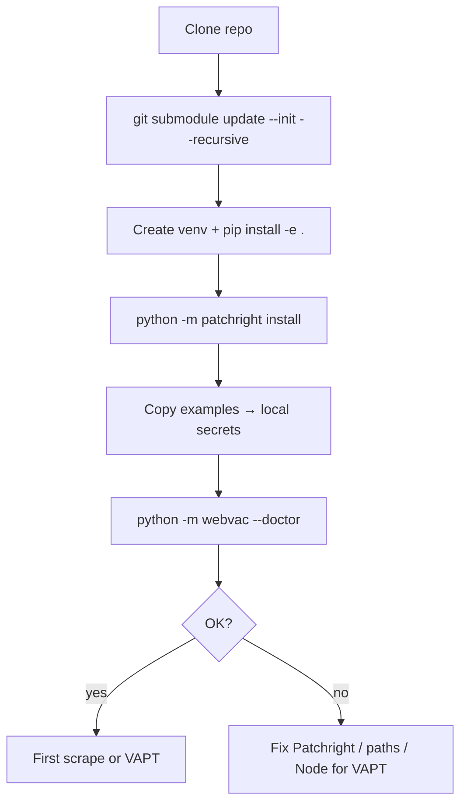
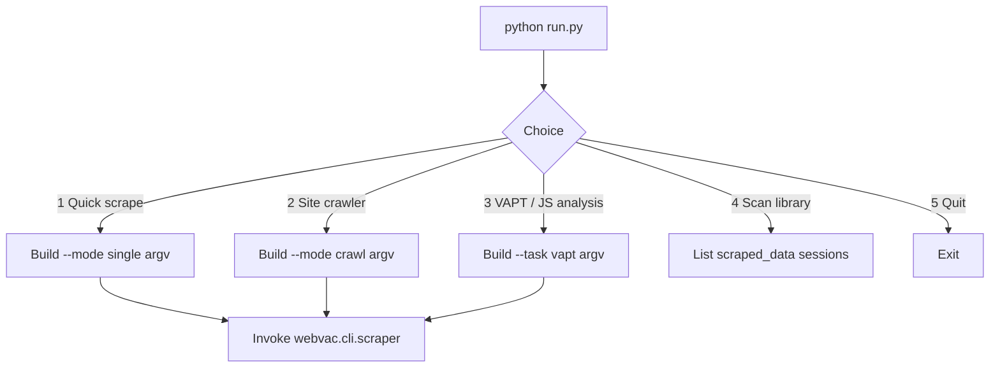
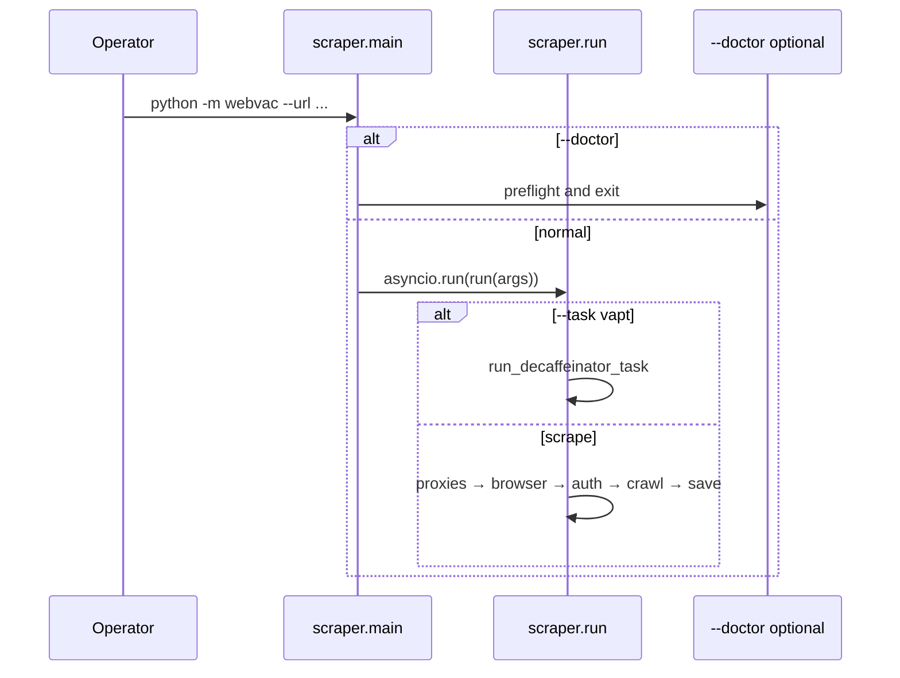
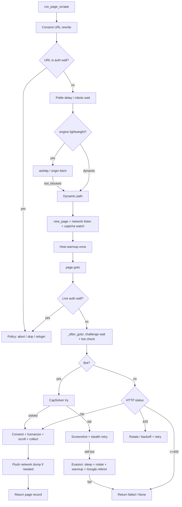
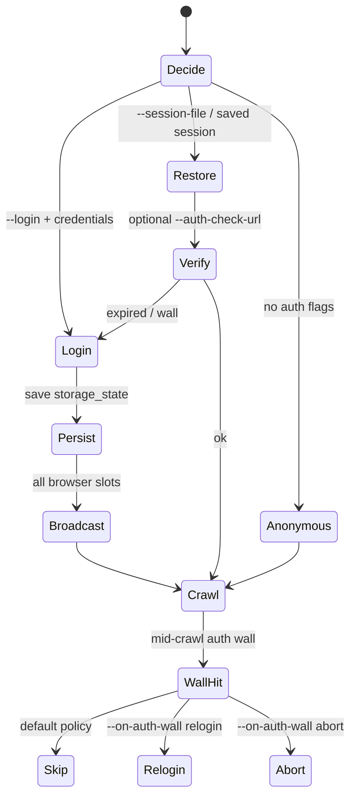
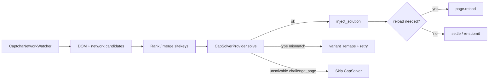
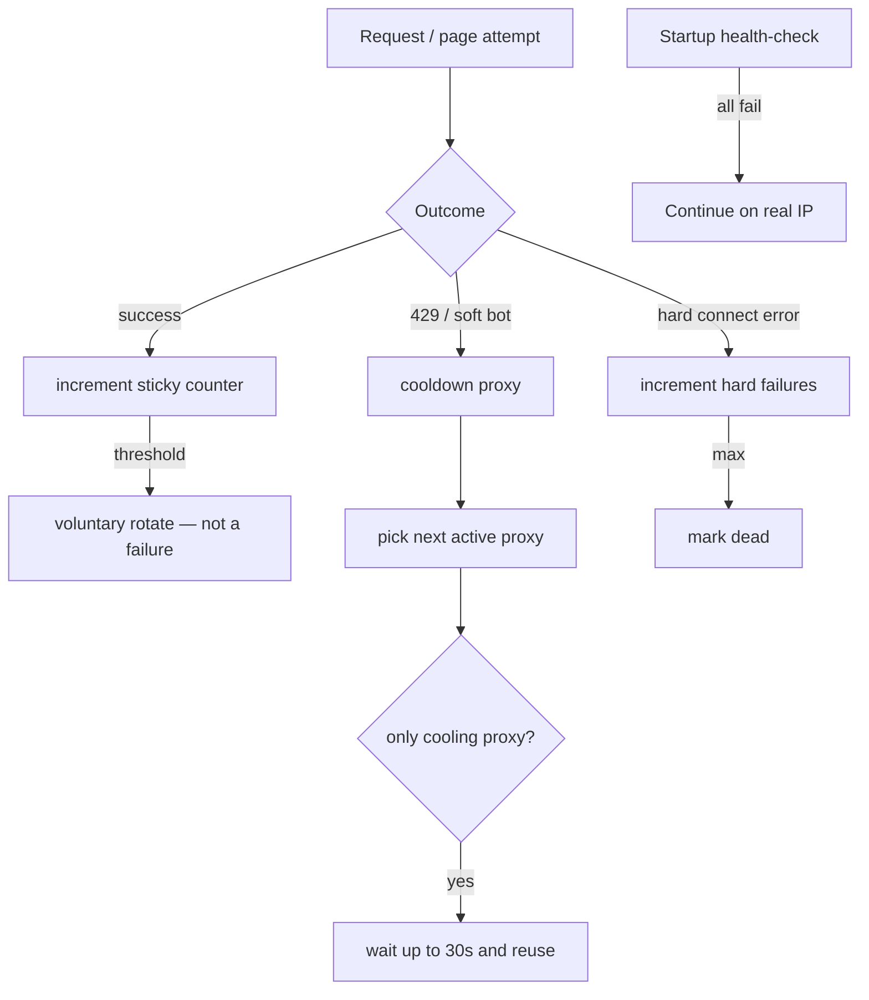
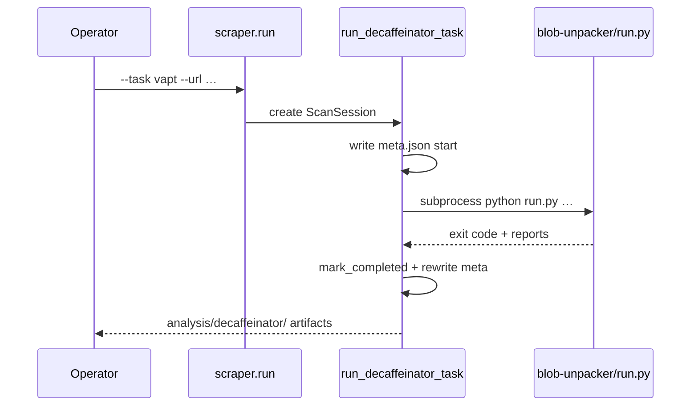
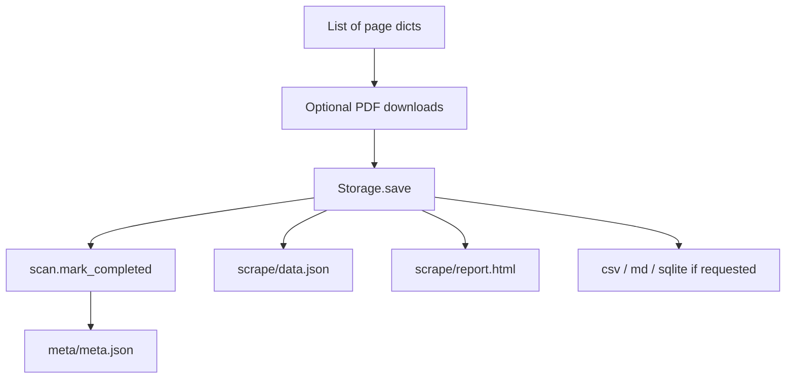
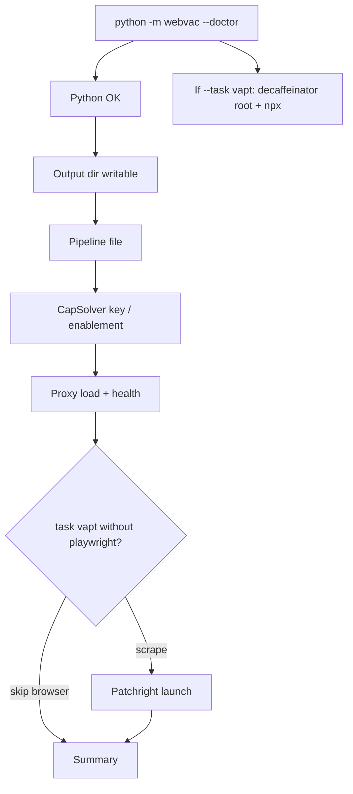

# WebVac workflows

End-to-end operator and runtime workflows with diagrams. For layer internals see [ARCHITECTURE.md](ARCHITECTURE.md) and the `architecture/` deep dives.

---

## 1. First-time setup



Local (gitignored) files typically created:

| File | Purpose |
|------|---------|
| `proxies.txt` | Optional proxy pool |
| `capsolver.key` | CapSolver API key (enables solver by default) |
| `auth_creds.json` | Login credentials / profile |
| `sessions/*.json` | Saved `storage_state` |

---

## 2. Interactive menu workflow



Scrape wizard common steps: auth mode → URL/limits → formats (`json,html`) → robots bypass → proxies → headless → screenshots.

---

## 3. CLI scrape workflow



### Typical commands

```bash
# Single page
python -m webvac --url https://example.com --mode single

# Site crawl
python -m webvac --url https://example.com --mode crawl --depth 3 --max-pages 50

# Authenticated crawl
python -m webvac --url https://example.com --mode crawl --login \
  --auth-profile auth_creds.json

# Session restore
python -m webvac --url https://example.com --session-file sessions/example_com_auth.json

# Disable CapSolver even if key exists
python -m webvac --url https://example.com --captcha-solver none

# VAPT
python -m webvac --task vapt --url https://example.com --vapt-profile deep
```

---

## 4. Per-page scrape workflow (critical path)

This is the heart of WebVac. Implemented in `webvac/core/page_scrape_flow.py`.



### Why order matters

1. **Auth wall before bot detect** — login pages often contain Turnstile/reCAPTCHA widgets; treating them as WAF would burn proxies and CapSolver credits incorrectly.
2. **CapSolver before proxy rotate** — widget tokens may clear the page without changing IP.
3. **Network flush on failure** — dumps land under `network/` for post-mortem.

Full detail: [CRAWL](architecture/CRAWL.md) · [CAPTCHA](architecture/CAPTCHA.md).

---

## 5. Auth workflow



Details: [AUTH](architecture/AUTH.md).

---

## 6. CapSolver workflow



**Enabled by default** when `capsolver.key`, `CAPSOLVER_API_KEY`, or `WEBVAC_CAPSOLVER_KEY` is present. Details: [CAPTCHA](architecture/CAPTCHA.md).

---

## 7. Proxy failure workflow



Details: [PROXY_ORIGIN](architecture/PROXY_ORIGIN.md).

---

## 8. VAPT workflow



Details: [VAPT](architecture/VAPT.md).

---

## 9. Persist / report workflow



Details: [DATA](architecture/DATA.md) · [SCAN_LAYOUT](SCAN_LAYOUT.md).

---

## 10. Doctor workflow



Failures exit non-zero; warnings (dead proxies, no CapSolver key) do not.
