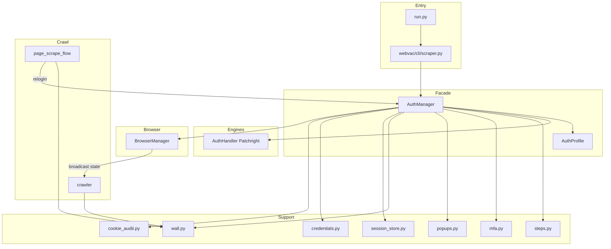
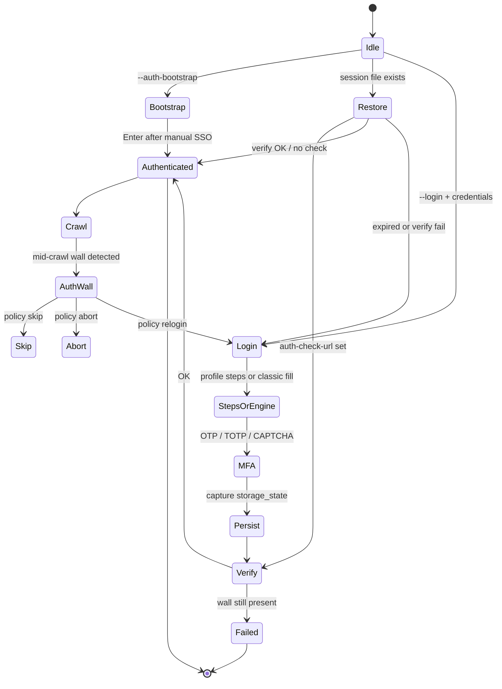
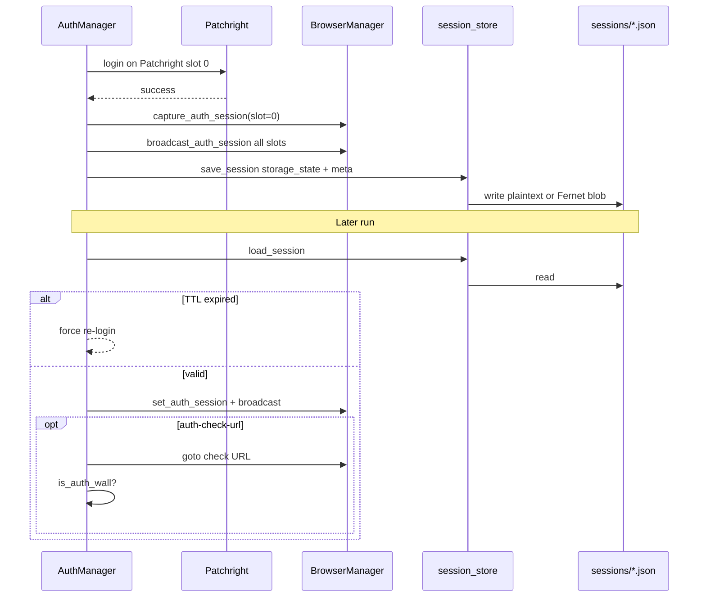
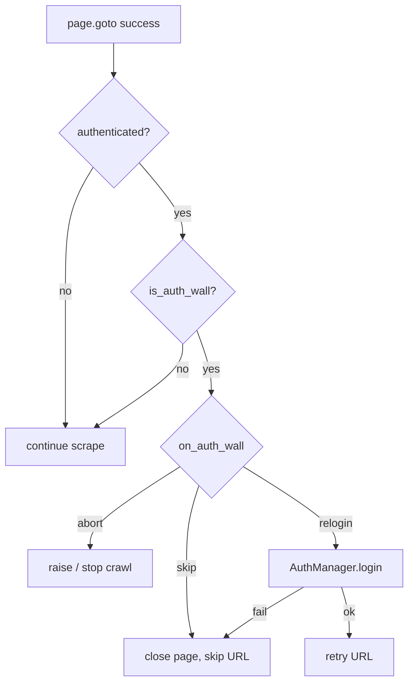
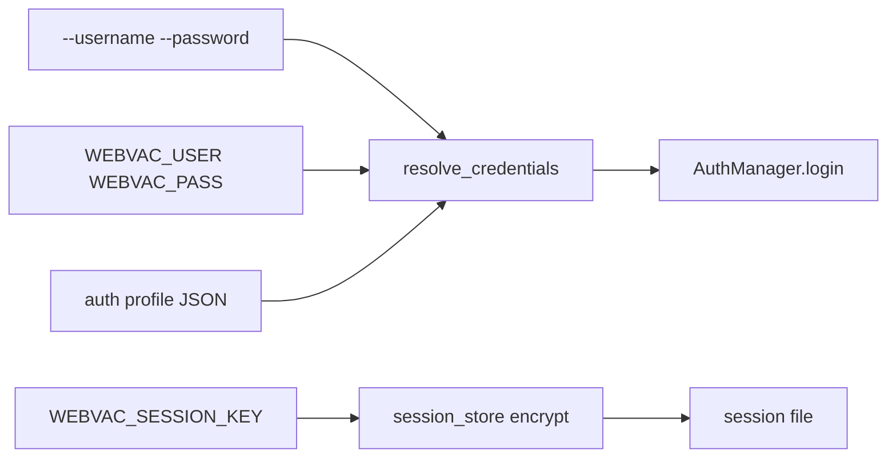

# Authentication Architecture

**Parent:** [Full System Architecture](../ARCHITECTURE.md)  
**Code root:** `webvac/auth/` · wiring in `webvac/cli/scraper.py`, `webvac/core/crawler.py`, `webvac/core/page_scrape_flow.py`, `webvac/utils/browser.py`

---

## 1. Goals

- Log in once with Patchright, persist session, reuse across crawl slots.
- Survive mid-crawl session loss (auth walls) with a safe default policy (`skip`).
- Support MFA/TOTP, multi-step forms, OAuth manual bootstrap, and optional encrypted sessions.

---

## 2. Component diagram



---

## 3. Auth lifecycle



---

## 4. Module responsibilities

| Module | Responsibility |
|--------|----------------|
| `manager.py` | Single facade: restore, login, verify, bootstrap, ensure, is_auth_wall |
| `profile.py` | Rich JSON profile: selectors, steps, totp, policies, TTL |
| `session_store.py` | `storage_state` I/O, TTL meta, optional Fernet |
| `credentials.py` | `WEBVAC_USER` / `WEBVAC_PASS`, redact helpers |
| `auth.py` | Patchright classic login (auto + manual selectors) |
| `steps.py` | Declarative multi-step runner |
| `mfa.py` | TOTP generation + interactive OTP/CAPTCHA pause |
| `wall.py` | Heuristics for login pages + logout URL deny |
| `popups.py` | Cookie/consent banner dismiss |
| `cookie_audit.py` | Flag warnings after login; VAPT reuse |
| `default_creds.py` | Vendor default-panel fingerprints |

---

## 5. Session & storage_state flow



**Formats accepted:**

1. Playwright `storage_state` (`cookies` + `origins`) — preferred  
2. Legacy plain cookie list JSON — normalized on load  

**Metadata (`_webvac_session_meta`):** `created_at`, `last_verified_at`, `ttl_sec`, `seed_url`

---

## 6. Mid-crawl auth-wall policy



Heuristics (`wall.py`): password inputs, login path keywords, sign-in titles, seed login path match.

Logout soft-deny when authed: `/logout`, `/signout`, `/sign-out`, `/log-out`.

---

## 7. Credential & secret surfaces



- Passwords redacted in `run.py` printed commands.
- Real `auth_creds.json` is gitignored; ship `examples/auth_creds.example.json` only.
- Profiles with `auth_engine: "nodriver"` are rejected (Nodriver was removed).

---

## 8. Login modes

| Mode | Login | Crawl |
|------|-------|-------|
| Default `--login` | Patchright (`AuthHandler`) | Patchright |
| `--auth-bootstrap` | Visible Patchright manual SSO | Patchright |
| `--session-file` only | Restore cookies (skip login) | Patchright |

Login always on **slot 0**. `--login` forces `--engine dynamic` (no lightweight).

---

## 9. CLI / env surface

```
--login
--login-url
--username / --password
--session-file
--auth-profile
--auth-check-url
--on-auth-wall abort|skip|relogin
--session-ttl
--auth-bootstrap
--otp-prompt
--no-auth-proxy-rotate
--dismiss-selector (repeatable)
```

Env: `WEBVAC_USER`, `WEBVAC_PASS`, `WEBVAC_SESSION_KEY`
