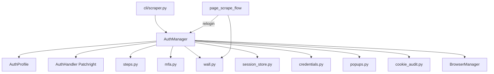
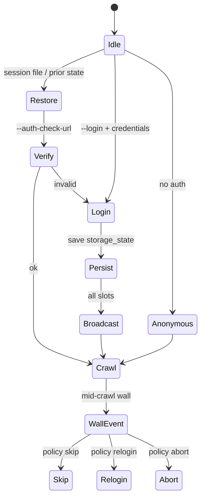
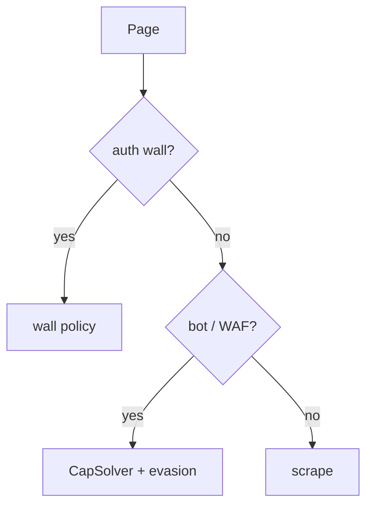

# Authentication architecture

**Parent:** [ARCHITECTURE](../ARCHITECTURE.md)  
**Code:** `webvac/auth/` · wiring in `cli/scraper.py`, `core/page_scrape_flow.py`, `utils/browser.py`

---

## 1. Goals

- Log in once with Patchright, persist `storage_state`, reuse across crawl slots.
- Survive mid-crawl session loss via **auth-wall** policy (default: `skip`).
- Support MFA/TOTP, multi-step forms, cookie audits, and optional Fernet-encrypted sessions.
- Never treat login pages as bot/WAF blocks.

---

## 2. Component diagram

---

## 3. Lifecycle

**Note:** OAuth “manual bootstrap” flags described in older notes are **not** in current code. Auth is Patchright login + session restore only.

---

## 4. AuthManager API

| Method | Role |
|--------|------|
| `restore(session_file)` | Load storage_state, TTL check, set + broadcast, optional verify |
| `login(seed_url)` | Resolve creds → Patchright login on slot 0 → persist → broadcast → verify → cookie audit |
| `verify(check_url)` | Navigate; fail if still auth wall |
| `ensure_authenticated` | Restore else login |
| `is_auth_wall` / `is_logout_url` | Heuristics |
| `on_auth_wall` | Normalized policy (`abort` \| `skip` \| `relogin`) |

---

## 5. Login paths

1. Goto login URL (CapSolver network watcher attached when key present).
2. Dismiss cookie/consent popups (`popups.py`).
3. One of:
   - **Declarative steps** — `run_steps_patchright` (`fill` / `click` / `wait` / `totp` / `otp_prompt`)
   - **Selector profile** — username/password CSS selectors
   - **Auto** — `AuthHandler` heuristics
4. Post-login CapSolver if a widget appeared (`_handle_post_login_captcha`).
5. Capture `storage_state`, save under `sessions/`, broadcast to slots.

### Credentials resolution order

CLI flags → auth profile JSON → `WEBVAC_USER` / `WEBVAC_PASS`.

---

## 6. Sessions

**Module:** `session_store.py`

| Feature | Detail |
|---------|--------|
| Format | Playwright `storage_state` preferred |
| Legacy | Cookie-list JSON normalized on load |
| Meta | `created_at`, `last_verified_at`, `ttl_sec`, `seed_url` |
| Encryption | Optional Fernet via `WEBVAC_SESSION_KEY` |
| Default path | `sessions/<host>_auth.json` |

---

## 7. MFA / TOTP

**Module:** `mfa.py` + profile fields

- `generate_totp(secret)` via `pyotp`
- Interactive `otp_prompt` / manual challenge stdin (timeout configurable)
- Profile: `totp_secret`, `otp_prompt`, step action `totp`

---

## 8. Auth walls (critical)

**Module:** `wall.py`

### Detection

| Strength | Signal |
|----------|--------|
| Strong | Path regex: `/login`, `/signin`, `/register`, Amazon `/ap/signin`, … |
| Soft | Password `<input>` + login-ish title |
| Logout deny | `/logout`, `/signout`, … when authenticated |

### Policies (`--on-auth-wall`)

| Policy | Behavior |
|--------|----------|
| `skip` (default) | Return `status=auth_wall` record; continue crawl |
| `relogin` | Attempt AuthManager login then retry |
| `abort` | Raise / stop crawl |

### Invariants

- Auth walls do **not** trigger bot retries, CapSolver-as-WAF, or proxy failure marks.
- `is_bot_detected*` returns **False** when the page is an auth wall (even if CAPTCHA widgets are present).

---

## 9. CLI surface

| Flag | Role |
|------|------|
| `--login` | Force fresh login |
| `--login-url` | Explicit login URL |
| `--username` / `--password` | Creds |
| `--auth-profile` | JSON profile path |
| `--session-file` | Restore storage_state |
| `--auth-check-url` | Post-auth verification URL |
| `--on-auth-wall` | `abort\|skip\|relogin` |
| `--session-ttl` | Session TTL seconds |
| `--otp-prompt` | Interactive OTP |
| `--dismiss-selector` | Extra popup selectors |
| `--no-auth-proxy-rotate` | Pin proxy while authenticated |

---

## 10. Supporting modules

| File | Role |
|------|------|
| `profile.py` | `AuthProfile`, loaders |
| `credentials.py` | Env / CLI resolution + redaction |
| `cookie_audit.py` | HttpOnly / Secure / SameSite warnings |
| `default_creds.py` | Vendor default-panel fingerprint DB (informational in page records) |
| `auth.py` | Low-level Patchright login / form helpers |

---

## 11. Related

- [CAPTCHA](CAPTCHA.md) — login + scrape CapSolver  
- [CRAWL](CRAWL.md) — mid-crawl wall handling  
- [SECURITY](../SECURITY.md) — credential storage  
