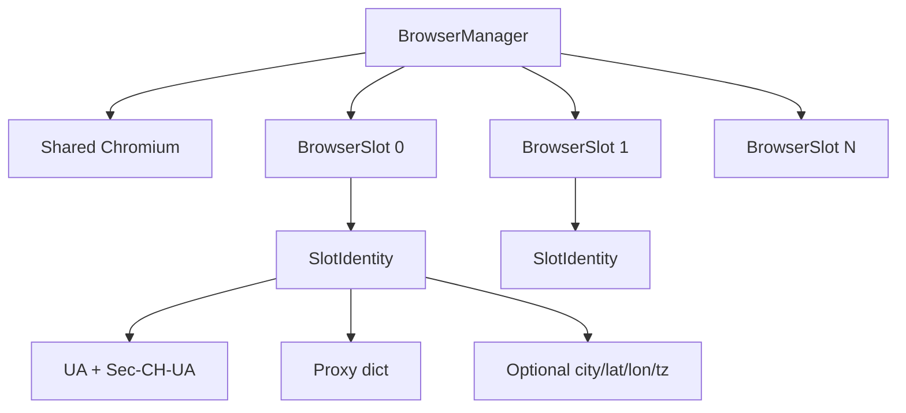
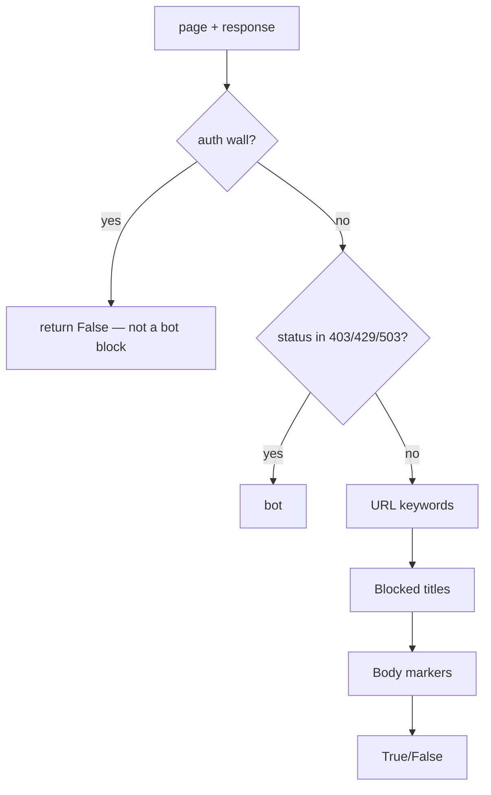

# Browser, humanize & detection architecture

**Parent:** [ARCHITECTURE](../ARCHITECTURE.md)  
**Code:** `webvac/utils/browser.py`, `browser_pool.py`, `humanize.py`, `detection.py`, `consent.py`, `screenshot.py`

---

## 1. Goals

- One Chromium, N isolated contexts (slots) with optional per-slot proxy/UA/geo identity.
- Human-like warmup, mouse, and scroll to reduce easy bot signals.
- Shared bot/CAPTCHA detection used by crawl flow and screenshots.
- Consent cookie/URL bypasses for known CMP patterns.

---

## 2. Pool model

| Concept | Detail |
|---------|--------|
| `BrowserSlot` | Context + lock + identity |
| `new_page(slot)` | Page inside that context |
| `rotate_proxy` | Rebuild slot with new proxy identity |
| `set_auth_session` / `broadcast_auth_session` | Apply storage_state |
| `capture_auth_session` | Export storage_state after login |

---

## 3. Humanize

**Module:** `humanize.py` · flags via `session_config`

| Switch | Behavior |
|--------|----------|
| `humanize` | Master enable |
| `humanize_warmup` / `ensure_host_warmup` | Once per host: visit site root → idle → settle → skim |
| `humanize_after_goto` / `settle_page` | Micro-moves after successful loads |
| Scroll | `_scroll_page` uses humanized wheel paths |
| Evasion | Extra `human_warmup` after proxy rotate |

CLI: `--no-humanize`, `--no-humanize-warmup`.

Cursor paths use bezier curves with per-page last-position memory (`get_cursor` / `set_cursor`).

---

## 4. Bot detection

**Module:** `detection.py`

Signals include Cloudflare “just a moment”, captcha titles, `__cf_chl`, hCaptcha/reCAPTCHA DOM, DataDome, PerimeterX, etc.

### Challenge wait

`wait_for_challenge_resolution` / `is_challenge_in_progress` wait up to `challenge_wait_ms` (default 45s) for transient CF JS challenges before hard-flagging.

Used by `BrowserManager.check_for_bot` and `Crawler._after_goto`.

---

## 5. Consent

**Module:** `consent.py`

- URL rewrites (e.g. known CMP bypass query params)
- Cookie injection for Google/Bing-style consent cookies where applicable
- `_handle_consent` / `--pause-for-consent` (headed) / `--no-consent-dismiss`

---

## 6. Screenshots

**Module:** `screenshot.py`

- Captures only when bot/CAPTCHA detected (`capture_if_blocked` / `capture_forced`)
- Bound to `{scan}/assets/screenshots/`
- Disable: `--no-screenshots`

---

## 7. Related

- [CRAWL](CRAWL.md) — when warmup / bot check run  
- [AUTH](AUTH.md) — why walls short-circuit detection  
- [PROXY_ORIGIN](PROXY_ORIGIN.md) — identity pin with residential playbook  
