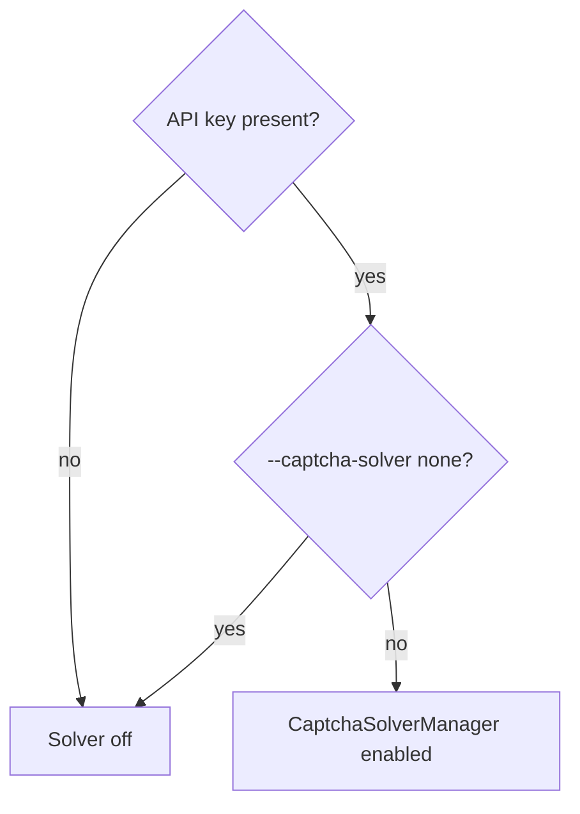
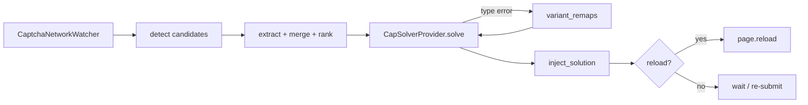

# CapSolver / CAPTCHA architecture

**Parent:** [ARCHITECTURE](../ARCHITECTURE.md)  
**Code:** `webvac/captcha/`

---

## 1. Goals

- Auto-solve **widget** CAPTCHAs (Turnstile, hCaptcha, reCAPTCHA v2/v3 + enterprise/invisible) via CapSolver.
- Merge DOM detection with network fingerprints for better sitekey / action discovery.
- Work in headless and headed Chromium.
- Skip unsolvable managed challenge pages without wasting API credits.

---

## 2. When CapSolver is enabled

Key sources (first hit wins):

1. `--captcha-api-key`
2. `CAPSOLVER_API_KEY` / `WEBVAC_CAPSOLVER_KEY`
3. `capsolver.key` or `.env` (`load_capsolver_key_from_files`)

Default config: `captcha_solver=capsolver`. Doctor reports “enabled by default” when a key is found.

---

## 3. Pipeline

| Stage | Module | Symbols |
|-------|--------|---------|
| Config | `config.py` | `CaptchaSolverConfig`, `load_capsolver_key_from_files` |
| Orchestrator | `manager.py` | `CaptchaSolverManager`, `solver_from_config`, `try_solve_on_page` |
| Detect | `detect.py` | DOM JS probes for widgets |
| Extract | `extract.py` | `extract_captcha_candidates`, `merge_dom_and_network`, `variant_remaps` |
| Network | `network_watch.py` | `CaptchaNetworkWatcher`, URL fingerprints |
| Provider | `providers/capsolver.py` | `CapSolverProvider`, `build_capsolver_task` |
| Inject | `inject.py` | `inject_solution`, `should_reload_after_inject` |
| Models | `models.py` | `CaptchaType`, `CaptchaInfo`, `SolverResult` |

---

## 4. Activation points in WebVac

| Context | When |
|---------|------|
| Scrape | After bot detection in `run_page_scrape` (first hit, stealth retry, evasion) |
| Login | Watcher on login page; post-submit `_handle_post_login_captcha` |
| Demo | `examples/captcha_smoke.py`, `captcha_watch_demo.py` |

---

## 5. Supported vs unsupported

| Type | CapSolver typically helps? |
|------|----------------------------|
| Turnstile | Yes |
| hCaptcha | Yes |
| reCAPTCHA v2 / invisible / enterprise | Yes |
| reCAPTCHA v3 / enterprise | Yes |
| `CHALLENGE_PAGE` / managed CF interstitial without sitekey | **No** — skip |
| Akamai / DataDome / PerimeterX (network-debug class) | **No** |

Network-debug CapSolver hints: [NETWORK](NETWORK.md).

---

## 6. Candidate ranking

1. Attach network watcher **before** navigation when possible.
2. Collect DOM candidates + network fingerprints.
3. Merge / rank (prefer matching type + sitekey).
4. Try up to N candidates; on CapSolver “wrong type” responses, apply `variant_remaps` and retry.
5. Inject token into hidden fields and fire site callbacks (patterns aligned with public solver demos).

---

## 7. CLI

| Flag | Meaning |
|------|---------|
| *(default)* | CapSolver on when key present |
| `--captcha-solver none` | Force disable |
| `--captcha-solver capsolver` | Explicit enable (still needs key) |
| `--captcha-api-key KEY` | One-off key (shell history risk) |
| `--captcha-timeout SECS` | Poll timeout (default 120) |

---

## 8. Related

- [CRAWL](CRAWL.md) — where `_try_auto_captcha` sits in the ladder  
- [AUTH](AUTH.md) — login CapSolver  
- [NETWORK](NETWORK.md) — challenge classification vs RUM noise  
