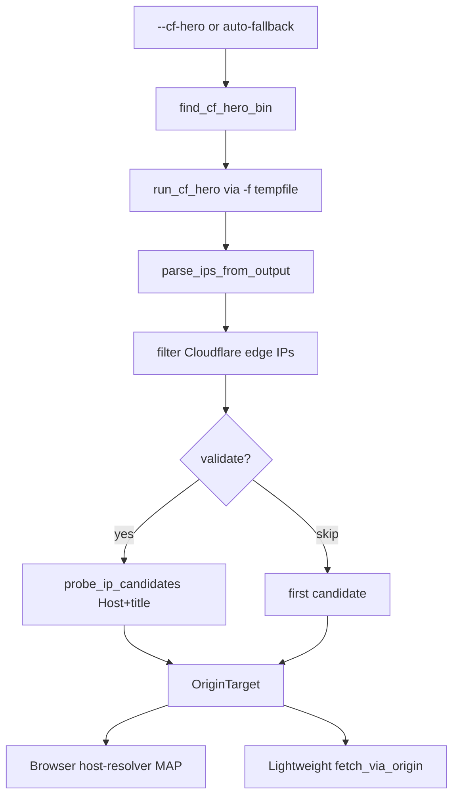

# CF-Hero / Origin Bypass Architecture

**Parent:** [Full System Architecture](../ARCHITECTURE.md)  
**Upstream tool:** [musana/CF-Hero](https://github.com/musana/CF-Hero)  
**Code:** `utils/cf_hero.py`, `utils/origin_probe.py`, `models/origin.py`, `webvac/cli/scraper.py`, `core/crawler.py`, `utils/browser.py`

---

## 1. Purpose

Discover the **real origin IP** of a Cloudflare-protected hostname, then scrape via:

1. **Browser path** — Chromium `--host-resolver-rules=MAP host ip` (vanity URLs still work; TLS Host matches).
2. **Lightweight path** — HTTP GET to `https://<origin_ip>/…` with `Host: <hostname>`.

---

## 2. Critical CLI contract

CF-Hero does **not** take a positional domain. WebVac always invokes:

```text
cf-hero -f <tempfile> [-v] [-title TITLE] [-px PROXY] [-w N] [extra…]
```

where the tempfile contains one hostname per line. Extra OSINT flags (API keys in `cf-hero.yaml`):

- `-shodan` `-censys` `-securitytrails` `-zoomeye`
- `-td` / `-dl` for related-domain technique

---

## 3. Flow



---

## 4. Operator flags

| Flag | Meaning |
|------|---------|
| `--cf-hero` | Discover origin before crawl |
| `--cf-hero-bin PATH` | Explicit binary |
| `--cf-hero-args "..."` | Extra flags (`-shodan` etc.) |
| `--cf-hero-timeout SECS` | Process timeout (default 300) |
| `--cf-hero-workers N` | CF-Hero `-w` |
| `--cf-hero-quiet` | Omit `-v` |
| `--cf-hero-log FILE` | Save raw stdout/stderr |
| `--origin-ip IP` | Manual origin (no CF-Hero) |
| `--origin-title TITLE` | Expected title (+ CF-Hero `-title`) |
| `--skip-origin-validate` | Use IP without title match |
| `--no-cf-hero-auto` | Disable mid-crawl auto discovery |

Install:

```bash
go install -v github.com/musana/cf-hero/cmd/cf-hero@latest
# ensure ~/go/bin is on PATH
```

Example:

```bash
python -m webvac --url https://target.example \
  --cf-hero --cf-hero-args "-shodan -censys" \
  --origin-title "Target Home" \
  --mode crawl --depth 2
```

---

## 5. Safety

- Only use against targets you are authorized to test.
- Prefer title validation; `--skip-origin-validate` is for emergency/debug.
- Auto-fallback is convenient but can surprise engagements — disable with `--no-cf-hero-auto` when in doubt.
- Raw CF-Hero logs may contain infrastructure details — treat as sensitive.
