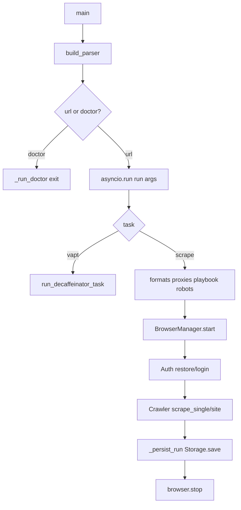
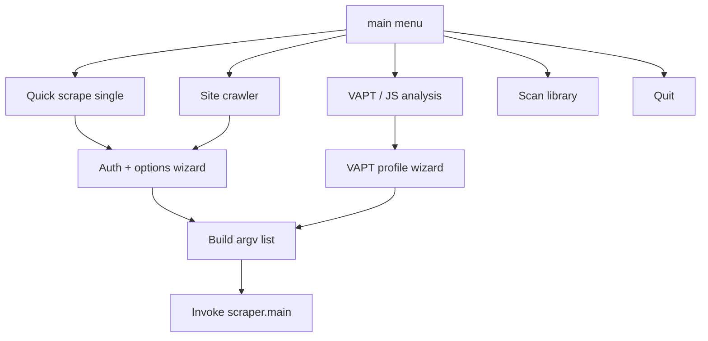

# CLI & interactive launcher architecture

**Parent:** [ARCHITECTURE](../ARCHITECTURE.md) · [WORKFLOWS](../WORKFLOWS.md)  
**Code:** `webvac/cli/scraper.py`, `webvac/cli/interactive.py`, `run.py`, `webvac/__main__.py`

---

## 1. Entry points

| Command | Resolves to |
|---------|-------------|
| `python -m webvac` | `webvac.cli.scraper:main` |
| `webvac` | same (console script) |
| `python run.py` | `webvac.cli.interactive:main` |
| `webvac-menu` | same |

`run.py` is only a shim; all logic lives in the package.

---

## 2. scraper.py flow

### Responsibilities of `run()`

1. Resolve output formats (default `json,html`).
2. Auto-pick `proxies.txt` / pipeline example when present.
3. Apply proxy playbook.
4. Build robots handler only if respecting robots.
5. Load proxies + optional health-check (dead pool → direct IP message).
6. Start browser with concurrency slots.
7. AuthManager restore or login.
8. Construct `Crawler` + `session_config` (humanize, CapSolver, network debug, …).
9. Execute scrape; download PDFs; `Storage.save`; stop browser.

---

## 3. Interactive menu

Scrape wizard fixes several production defaults: `--format json,html`, `--no-robots`, `--wait-until load`, auto `proxies.txt` when present.

---

## 4. Doctor

`python -m webvac --doctor` (optionally with `--url` / `--task vapt`):

| Check | Severity |
|-------|----------|
| Python version | OK / FAIL |
| Output dir writable | OK / FAIL |
| Pipeline file | OK / WARN |
| CapSolver key + default enablement | OK / WARN / FAIL |
| Proxy file load + health | OK / WARN |
| Patchright launch | OK / FAIL (may skip for some VAPT) |
| De-Caffeinator root + npx | when `--task vapt` |

Exit code `1` if any FAIL.

---

## 5. Argv / config merge

CLI flags overlay `DEFAULT_CONFIG` into a `session_config` dict consumed by BrowserManager, Crawler, CapSolver, etc. See [CONFIG_REFERENCE](../CONFIG_REFERENCE.md).

Notable defaults:

- Robots bypassed unless `--respect-robots`
- CapSolver on when key present unless `--captcha-solver none`
- Network debug on unless `--no-network-debug`

---

## 6. Related

- [VAPT](VAPT.md)  
- [CRAWL](CRAWL.md)  
- [CAPTCHA](CAPTCHA.md)  
