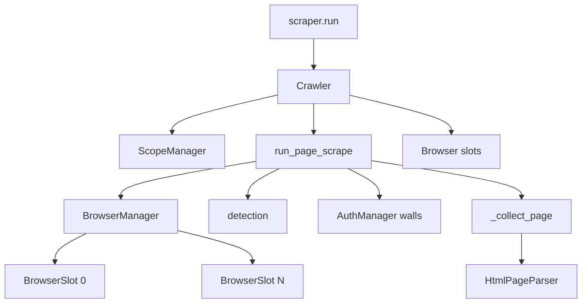
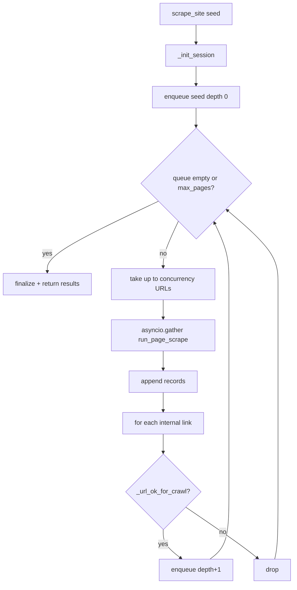
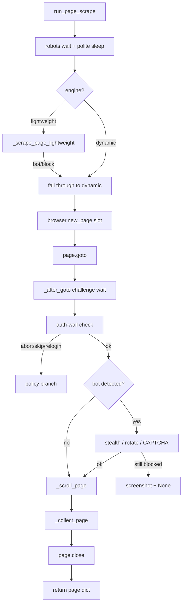
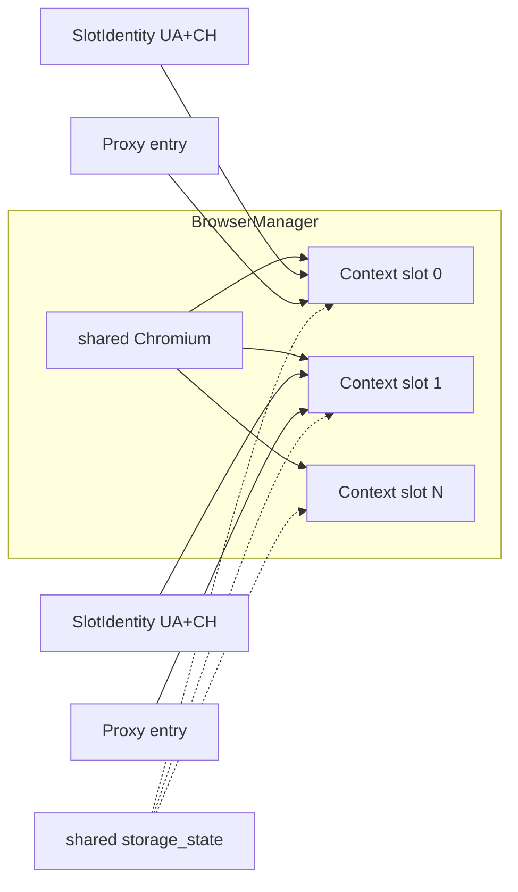
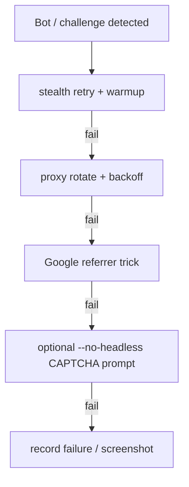
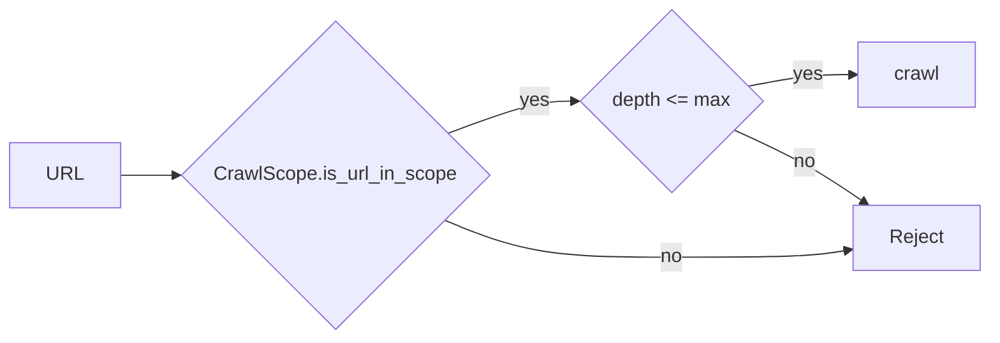
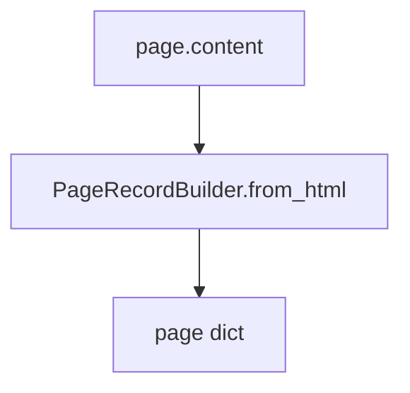

# Crawl & Browser Architecture

**Parent:** [Full System Architecture](../ARCHITECTURE.md)  
**Code:** `core/crawler.py`, `core/page_scrape_flow.py`, `utils/browser.py`, `utils/browser_pool.py`, `utils/detection.py`, `scope/scope_manager.py`

---

## 1. Goals

- Crawl single pages or whole sites with depth / page limits.
- Run N concurrent workers as isolated browser contexts.
- Survive bot challenges with retries, origin bypass, and CAPTCHA prompts.
- Stay polite (robots, delays) and in-scope.

---

## 2. Component diagram

---

## 3. BFS crawl algorithm

**`_url_ok_for_crawl` checks:**

1. Scope (host / subdomain policy)  
2. Depth limit  
3. Allow / deny URL regex  
4. Logout URL soft-deny when authenticated  
5. robots.txt (unless disabled)

---

## 4. Per-page scrape flow

---

## 5. Browser pool model

| Concept | Meaning |
|---------|---------|
| Slot | Isolated `BrowserContext` + page factory |
| SlotIdentity | UA / Sec-CH-UA fingerprint per worker |
| Auth broadcast | Same cookies/origins injected into every slot after login |
| Proxy rotate | Rebuild context for one slot; reinject auth if needed |

Key APIs: `start`, `new_page(slot)`, `rotate_proxy`, `set_auth_session`, `broadcast_auth_session`, `capture_auth_session`, `human_warmup`, `prompt_captcha_solve`, `reconfigure_host_resolver`.

---

## 6. Modes

| Mode | Entry | Behavior |
|------|-------|----------|
| `single` | `scrape_single` | One URL, no link follow |
| `crawl` | `scrape_site` | BFS internal links |
| `engine=dynamic` | default | Patchright |
| `engine=lightweight` | CLI | aiohttp first; upgrade to dynamic on blocks; **disabled when `--login`** |

---

## 7. Anti-block escalation

Detection lives in `utils/detection.py` (`is_bot_detected`, `wait_for_challenge_resolution`).

---

## 8. Scope architecture

`scope/scope_manager.py`:

- Seed host is in-scope.
- Optional subdomain allow.
- Depth tracking per visit.
- Feeds crawler URL admission.

---

## 9. Collection branch

The default path builds page records directly from scraped HTML.
