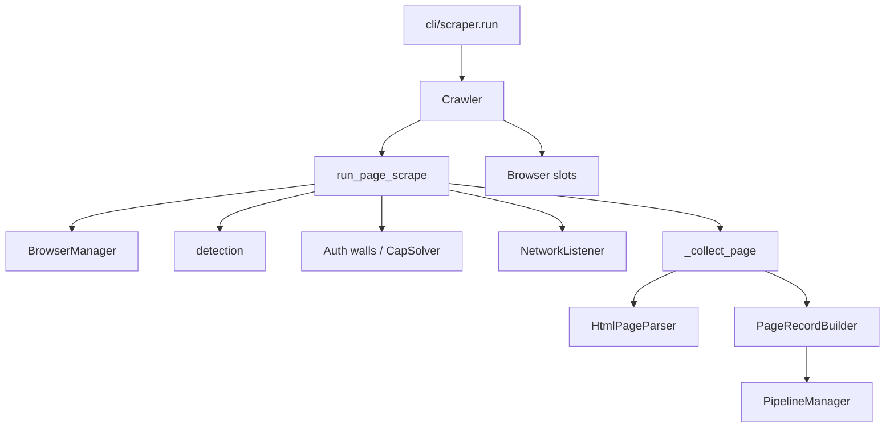
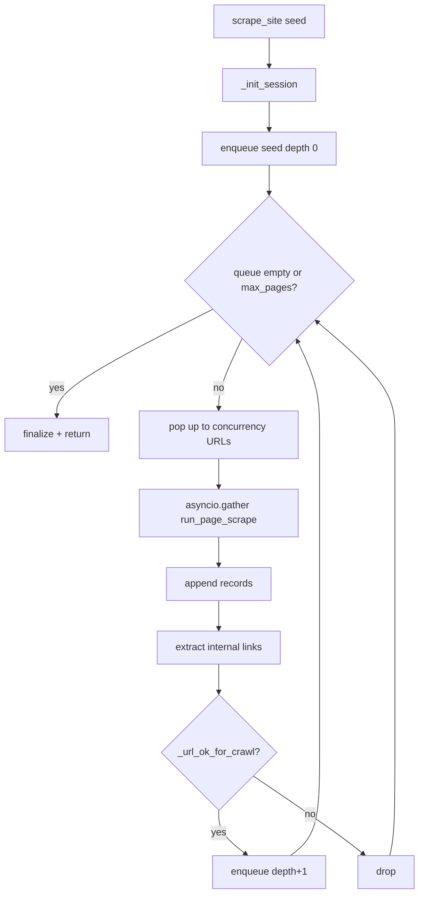
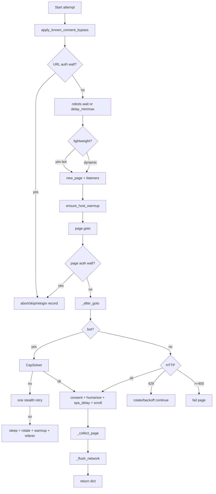

# Crawl & page-scrape architecture

**Parent:** [ARCHITECTURE](../ARCHITECTURE.md) · [WORKFLOWS](../WORKFLOWS.md)  
**Code:** `webvac/core/crawler.py`, `webvac/core/page_scrape_flow.py`, `webvac/core/pipeline.py`

---

## 1. Goals

- Scrape one URL or BFS-crawl a site with depth / page limits.
- Run N concurrent workers as isolated browser contexts (slots).
- Survive soft blocks with CapSolver, stealth retry, and evasion — without confusing auth walls for WAF.
- Stay in-scope (domain, allow/deny regex, logout soft-deny when authenticated).

---

## 2. Component diagram



---

## 3. Modes

| Mode | API | Behavior |
|------|-----|----------|
| `single` | `Crawler.scrape_single(url)` | One URL; no link follow |
| `crawl` | `Crawler.scrape_site(start_url)` | BFS over internal links |
| `engine=dynamic` | default | Patchright via `run_page_scrape` |
| `engine=lightweight` | CLI | aiohttp / origin fetch first; on bot block → dynamic. Forced off when `--login` |

---

## 4. BFS algorithm



### Structures

- `visited: set`, `queued: set`, `queue: deque[(url, depth)]`
- `max_pages is None` → unlimited (until queue empty)
- Batch size = `concurrency`

### `_url_ok_for_crawl` checks

1. Not an auth-wall URL (path heuristics)
2. Logout soft-deny when authenticated / `deny_logout_urls`
3. Same domain (optional `--allow-subdomains`)
4. Allow / deny URL regex
5. Origin vanity-host exception when `origin_access` is set  
Robots are enforced earlier in the BFS loop when robots are respected (default is bypass).

---

## 5. Per-page critical path

Implemented by `run_page_scrape(crawler, url, depth, slot)`.



### Anti-block ladder

| Step | Action |
|------|--------|
| 1 | CapSolver on live page |
| 2 | Stealth retry (same IP, new page, challenge wait) |
| 3 | Evasion: random 15–60s sleep → proxy rotate → `human_warmup` → goto with Google `Referer` → CapSolver again |
| 4 | Give up → failed page / `None` |

Outer attempts: `range(max_retries + 1)` (default `max_retries=3` → up to 4 tries) for exceptions / 429.

### `_collect_page` signature

```text
_collect_page(page, url, response, depth, screenshot_path=None) → dict
```

Do **not** pass a network collector positionally (historical bug: collided with `screenshot_path`).

---

## 6. Session init (`_init_session`)

On first scrape of a run, crawler creates `ScanMetadata` + `ScanSession`, ensures layout dirs, binds:

- screenshot module → `assets/screenshots/`
- network debug dir → `network/`
- asset downloader → `assets/pdfs/`

Parent scan id: `--parent-scan-id` or latest prior session folder.

---

## 7. Concurrency & slots

| Concept | Meaning |
|---------|---------|
| `concurrency` | Parallel pages per BFS batch |
| `slot` | Index into browser context pool |
| Slot identity | UA + Sec-CH-UA + optional geo/tz from pinned proxy |
| Auth | Login on slot 0; state broadcast |

When authenticated, voluntary sticky proxy rotate is suppressed (`auth_pin_proxy`).

---

## 8. Pipelines

`PipelineManager` (`core/pipeline.py`) loads an optional user Python file (`--pipeline-file`, default `examples/pipeline.example.py` when present) to transform page records before storage.

---

## 9. Failure records

| Status | When |
|--------|------|
| `success` | Parsed HTML page |
| `auth_wall` | Wall policy skip (not a scrape failure) |
| `failed` | Bot block exhausted, HTTP error, exception, timeout |

Failed placeholders are still saved so reports show coverage gaps.

---

## 10. Related docs

- [BROWSER](BROWSER.md) — pool, humanize, detection  
- [CAPTCHA](CAPTCHA.md) — CapSolver ladder  
- [AUTH](AUTH.md) — walls / relogin  
- [NETWORK](NETWORK.md) — dumps  
- [DATA](DATA.md) — parse / export  
