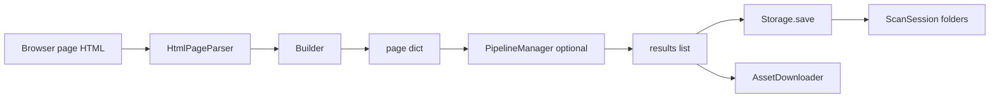
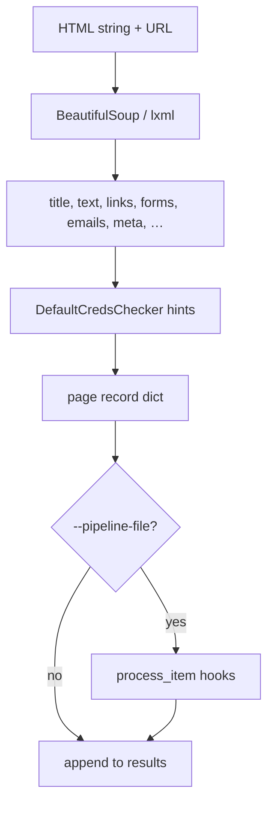
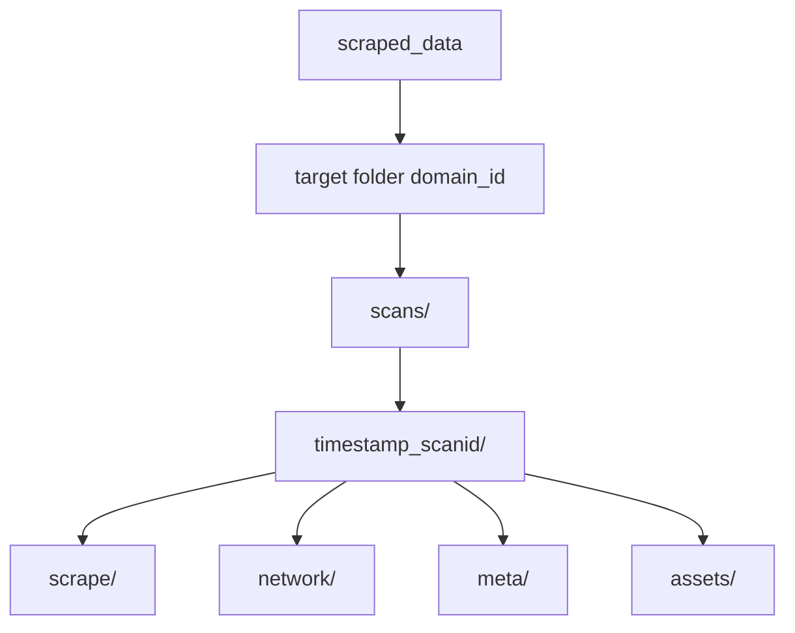
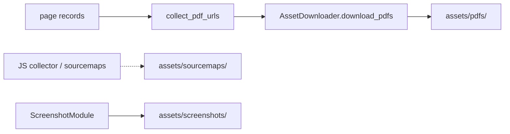
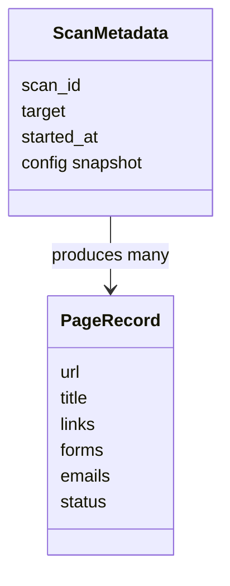

# Data & Storage Architecture

**Parent:** [Full System Architecture](../ARCHITECTURE.md)  
**Code:** `data/`, `store/`, `models/`, `utils/asset_downloader.py`

---

## 1. Goals

- Turn raw HTML into a stable **page record** dict.
- Persist versioned scan sessions with multi-format exports.
- Diff against prior scans and download discovered assets.

---

## 2. Component diagram

---

## 3. Page record pipeline

**Key types:**

| Module | Role |
|--------|------|
| `data/html_parser.py` | DOM extraction |
| `data/page_record.py` | `PageRecordBuilder.from_html` |
| `core/pipeline.py` | User post-process hooks |
| `models/scan.py` | `ScanMetadata`, `TargetMetadata` |

---

## 4. Scan session layout

`store/scan_session.py` owns path helpers and parent-scan chaining (`--parent-scan-id`).

---

## 5. Export formats

`data/storage.py` → `Storage.save`:

| Format | Typical file |
|--------|----------------|
| JSON | `scrape/data.json` |
| CSV | `scrape/data.csv` |
| HTML | `scrape/report.html` |
| Markdown | `scrape/data.md` |
| SQLite | `scrape/data.sqlite` |
| all | union of above |

Screenshots land in `assets/screenshots/`; network failure dumps in `network/`.

---

## 6. Asset download path

Triggered from `scraper._persist_run` after crawl completes (or on interrupt with partial results).

---

## 7. Models overview

---

## 8. Data contracts (page dict)

Typical fields produced for scrape mode (simplified):

- Identity: `url`, `final_url`, `title`, `status`
- Content: `text`, `headings`, `meta`
- Graph: `links` (`internal` / `external`), `forms`
- Signals: `emails`, `phones`, default-cred hints
- Ops: timestamps, depth, errors, bot flags

User pipelines must treat this dict as the contract; avoid breaking Storage/HTML report renderers.
