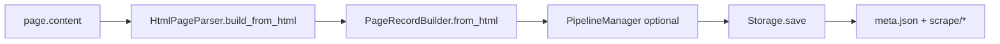

# Data, parse & storage architecture

**Parent:** [ARCHITECTURE](../ARCHITECTURE.md)  
**Code:** `webvac/data/html_parser.py`, `page_record.py`, `storage.py`, `core/pipeline.py`, `store/scan_session.py`

---

## 1. Goals

- Turn rendered HTML into structured page records.
- Apply status overrides (auth wall / bot page).
- Optionally run user pipelines.
- Export multi-format artifacts into the scan session layout.

---

## 2. Pipeline

`Crawler._collect_page` is the bridge from a live Page to `PageRecordBuilder`.

---

## 3. Parsed fields

| Field | Source |
|-------|--------|
| `url`, `status`, `scraped_at` | Identity |
| `title` | `<title>` |
| `meta` | name / property / http-equiv |
| `open_graph` / `twitter_card` | `og:*` / `twitter:*` |
| `structured_data` | JSON-LD |
| `headings` | h1–h6 |
| `paragraphs` | `
` |
| `links` | url, text, internal/external, rel (honeypots skipped) |
| `images` | src, alt, dimensions |
| `tables` / `lists` / `forms` | Structured |
| `media` | video / audio / iframe |
| `code_blocks` | pre/code |
| `emails` / `phone_numbers` / `social_links` | Regex / known hosts |
| `word_count` | Full text |
| `default_creds` | Vendor panel fingerprint matches |
| `targeted_data` | `--extract-css` / `--extract-xpath` |
| `screenshot` | Path if captured |
| `error` | Present on failures |

---

## 4. Status overrides

| Status | Meaning |
|--------|---------|
| `success` | Normal parsed page |
| `auth_wall` | Login/register wall (policy skip) — **not** a hard failure |
| `failed` | Bot/WAF page, HTTP error, exception, exhausted retries |

Sync bot heuristics in `PageRecordBuilder` can mark challenge HTML as `failed` even if the navigator thought it was fine.

---

## 5. Export formats

| Format | File under `scrape/` |
|--------|----------------------|
| `json` | `data.json` |
| `html` | `report.html` |
| `csv` | `data.csv` |
| `markdown` | `report.md` |
| `sqlite` | `{slug}.db` |
| `all` | everything |

Default CLI: `json,html`.

`Storage.save` always calls `scan.mark_completed()` before writing `meta.json` so `completed_at` is populated.

---

## 6. Assets

- PDFs: `utils/asset_downloader.py` → `assets/pdfs/` when `download_pdfs` enabled  
- Screenshots: `assets/screenshots/`  
- Sourcemaps directory reserved in layout  

---

## 7. Related

- [SCAN_LAYOUT](../SCAN_LAYOUT.md)  
- [CRAWL](CRAWL.md)  
- [CONFIG_REFERENCE](../CONFIG_REFERENCE.md)  
