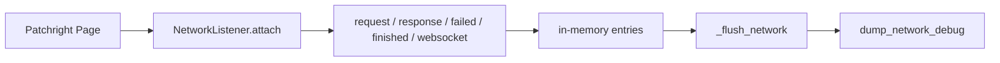

# Network listener & debug architecture

**Parent:** [ARCHITECTURE](../ARCHITECTURE.md)  
**Code:** `webvac/utils/network_listener.py`, `webvac/utils/network_debug.py` · wired in `core/page_scrape_flow.py`

---

## 1. Goals

- Capture XHR/fetch/document/script/websocket traffic during each page attempt.
- Persist JSON dumps under `{scan}/network/` for failure diagnosis.
- Classify challenge types and CapSolver suitability.
- Ignore analytics noise (Cloudflare RUM/beacons) that previously caused false `unknown_challenge` alarms.

---

## 2. NetworkListener



### Entry fields (representative)

`page_url`, `request_url`, `method`, `resource_type`, headers, `post_data`, `status`, `content_type`, `body_preview` (truncated), optional websocket messages.

Resource focus: `xhr`, `fetch`, `websocket`, `eventsource`, `document`, `script` (+ failed/4xx of other types).

---

## 3. Dump policy

| Setting | Behavior |
|---------|----------|
| `network_debug=True` (default) | Dump on failures / challenges / auth-wall paths |
| `network_debug_always` | Also dump successful pages |
| `--no-network-debug` | No attach, no dumps |

Path pattern: `{scan}/network/{host}_{UTC_timestamp}.json`

Payload: `page_url`, `final_url`, `reason`, `doc_status`, `captured_at`, `summary`, `entries`.

---

## 4. Challenge classification

Ordered classifiers (first match wins):

1. `turnstile`
2. `hcaptcha`
3. `recaptcha_v3`
4. `recaptcha_enterprise`
5. `recaptcha_v2`
6. `managed_cf`
7. `akamai`
8. `datadome`
9. `perimeterx`
10. else `unknown_challenge` if generic challenge hints match

### CapSolver suitability

| Suitable | Not suitable |
|----------|--------------|
| turnstile, hcaptcha, recaptcha_* | managed_cf, akamai, datadome, perimeterx, unknown_challenge |

Summary includes `capsolver_can_help`, `capsolver_note`, `tagged` samples.

### Noise ignored (not challenges)

```text
cdn-cgi/rum
cdn-cgi/beacon
cdn-cgi/script_monitor
cloudflareinsights.com
static.cloudflareinsights.com
```

Bare `cdn-cgi` alone is **not** treated as a challenge hint anymore (avoids RUM false positives).

---

## 5. Root-cause hints

Examples emitted into `summary.root_cause_hints`:

- `challenge_or_captcha_traffic`
- `challenge:<type>`
- `capsolver_may_help` / `capsolver_unlikely`
- `rate_limited_429`
- `auth_or_forbidden`
- `upstream_5xx`
- `no_network_events_captured`

---

## 6. Related

- [CRAWL](CRAWL.md) — `_attach_network` / `_flush_network`  
- [CAPTCHA](CAPTCHA.md) — widget solving vs managed challenges  
- [SCAN_LAYOUT](../SCAN_LAYOUT.md) — where dumps live  
