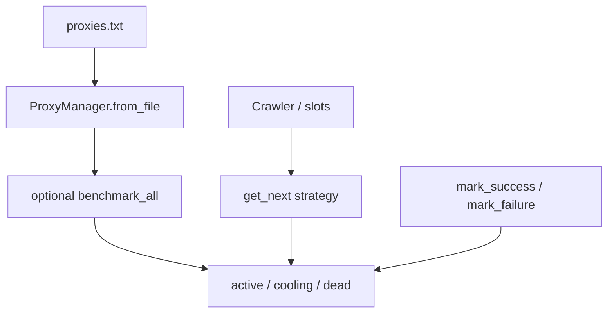

# Proxy, robots & origin architecture

**Parent:** [ARCHITECTURE](../ARCHITECTURE.md)  
**Code:** `webvac/utils/proxy.py`, `proxy_playbook.py`, `robots.py`, `origin_probe.py`, `models/origin.py`

---

## 1. Goals

- Rotate proxies with latency / round-robin / random strategies.
- Apply residential vs datacenter **playbooks** (sticky, cooldown, geo pin).
- Health-check at startup; **continue direct** if the whole pool is dead.
- Respect or bypass robots.txt (default: **bypass**).
- Support authorized CDN→origin IP probing (library / session_config — not a casual CLI footgun).

---

## 2. ProxyManager



### Strategies

| Strategy | Behavior |
|----------|----------|
| `latency` (default) | Prefer low EMA latency; random among top third |
| `round_robin` | Walk active pool |
| `random` | Uniform among active |

### Sticky requests

After successes, `increment_request_count`; when `sticky_requests` threshold hit → **voluntary rotate** (not counted as failure). `0` disables. Suppressed while authenticated if auth pin enabled.

### Cooldown vs hard failure

| Class | Examples | Effect |
|-------|----------|--------|
| Transient | 429, timeout, soft bot | Cooldown `proxy_cooldown_seconds`; retire after `max_cooldown_failures` |
| Hard | connection refused, DNS | Hard failure counter → dead at `max_failures` |

Sole cooling proxy: may wait up to `SOLE_PROXY_WAIT_CAP_SEC` (30s) and reuse.

### Health-check fallback

Startup benchmarks against `health_check_url` (default ipify) unless `--no-health-check`.  
**If all proxies fail:** warn and continue on the operator’s real IP. Scrape does not abort.

### Identity pin

Each proxy can lock UA + Sec-CH-UA + optional US geo/timezone (residential playbook) for consistency.

---

## 3. Playbooks (`--proxy-playbook`)

| Playbook | Sticky | Strategy | Cooldown | Geo pin |
|----------|--------|----------|----------|---------|
| `residential` | 25 | latency | 600s | yes |
| `datacenter` | 5 | round_robin | 120s | no |
| `none` | CLI/config defaults | | | |

Explicit CLI values win over playbook defaults when they differ from global defaults (`apply_proxy_playbook`).

---

## 4. Proxy file format

```text
http://ip:port
http://ip:port|username|password
# comments allowed
```

Auto-used from `./proxies.txt` when present and no `--proxy-file` passed.

---

## 5. Robots

| Flag | Behavior |
|------|----------|
| `--no-robots` (default **True**) | Bypass robots.txt |
| `--respect-robots` | Fetch and obey |
| `--ignore-crawl-delay` | Ignore Crawl-delay when respecting |

`RobotsHandler` uses a browser-like UA. 404 → allow-all; 401/403 → conservative disallow-all.

---

## 6. Origin probe (authorized use only)

**Modules:** `models/origin.py`, `utils/origin_probe.py`

Allows fetching via origin IP while sending the public `Host` header (and Chromium host-resolver mapping) when you have explicit authorization to bypass CDN edges.

Wired through `session_config["origin_access"]` into the crawler — **not** exposed as a casual public CLI switch in the scrape UX. Misuse can violate terms of service and laws.

Helpers: `fetch_via_origin`, `validate_origin` (title match), `is_cloudflare_ip`.

---

## 7. Related

- [CRAWL](CRAWL.md) — rotate points in the scrape ladder  
- [BROWSER](BROWSER.md) — slot identities  
- [SECURITY](../SECURITY.md)  
