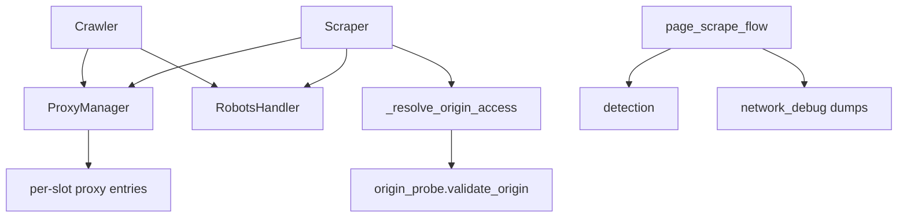
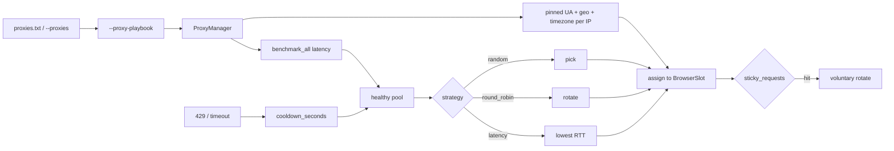
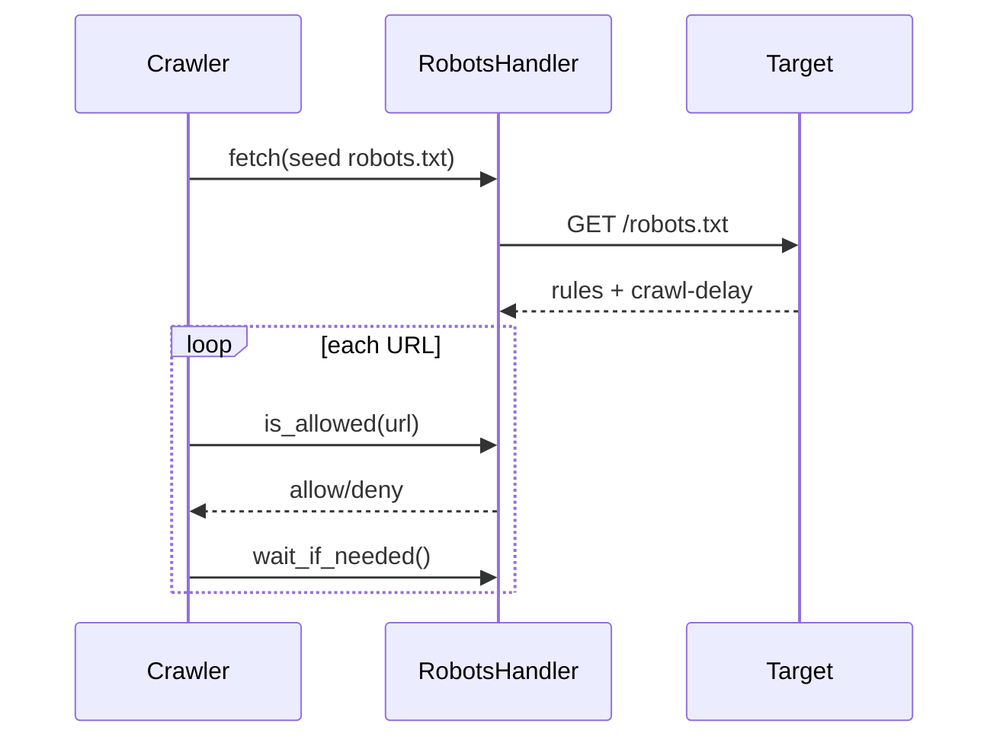
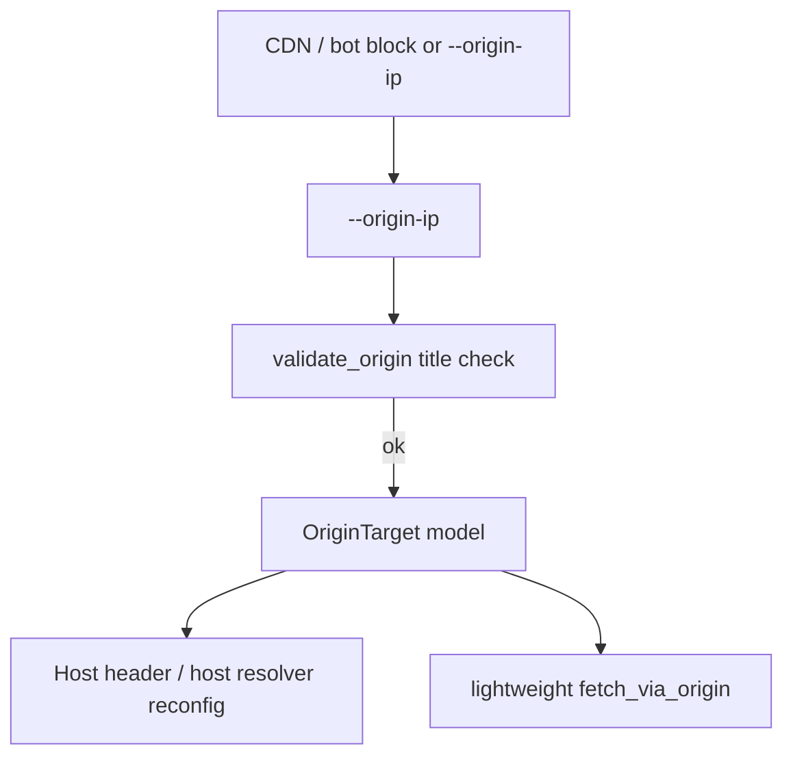

# Proxy, Robots & Origin Architecture

**Parent:** [Full System Architecture](../ARCHITECTURE.md)  
**Code:** `utils/proxy.py`, `utils/robots.py`, `utils/origin_probe.py`, `utils/detection.py`, `utils/network_debug.py`

---

## 1. Goals

- Route traffic through healthy proxies with strategy + cooldown.
- Obey robots.txt (unless explicitly disabled).
- Optionally scrape via **origin IP + Host header** when CDN edge blocks the browser (authorized use only — manual IP only).
- Persist network debug dumps on scrape failures for diagnosis.

---

## 2. Component diagram

---

## 3. Proxy architecture

**Auth interaction:** when authenticated / `--login`, voluntary rotate on slot 0 is suppressed (`auth_pin_proxy`). Forced rotate reinjects `storage_state` and may re-verify `--auth-check-url`.

**Pool rules:**

- Concurrent slots get **distinct** proxies while the pool lasts; only wrap when `concurrency > pool size`.
- Bot/challenge: stealth retry on the same IP, then **one** cooldown strike + rotate (not two).
- Timeouts → transient cooldown; connection/proxy refused → hard failure counter.
- Sole proxy after 429: wait up to 30s then reuse the same IP (do not abort the crawl).
- SOCKS health-check uses `aiohttp-socks` when installed; otherwise SOCKS lines stay active (not retired).
- `sticky_requests=0` disables voluntary rotate (does **not** mean rotate every request).

### Residential playbook

Use `--proxy-playbook residential` with a residential proxy file:

| Setting | Default applied |
|---------|-----------------|
| `sticky_requests` | 25 (keep exit IP for cookies / rate windows) |
| `proxy_strategy` | `latency` |
| `proxy_cooldown_seconds` | 600 |
| Identity | Each proxy locks UA + Sec-CH-UA + US city geo + matching timezone |

Explicit `--sticky-requests` / `--proxy-strategy` / `--cooldown-seconds` still win when they differ from global config defaults.

**Provider sticky sessions:** many residential vendors pin the ISP IP via username tokens (e.g. `user-session-abc123` or `user-country-us-session-xyz`). Put that username in `proxies.txt` as `http://host:port|user-session-…|password` so the vendor sticky window aligns with WebVac’s `sticky_requests` counter.

**Geo match:** `ProxyManager` assigns one identity from a curated pool so the same source IP always presents the same device + timezone. Browser contexts consume `SlotIdentity.timezone` / lat / lon instead of picking a random city that would disagree with the UA pin.

Datacenter playbook (`--proxy-playbook datacenter`): sticky=5, round-robin, shorter cooldown, **geo not pinned** (`pin_geo=False`) so timezone can rotate independently of UA.

---

## 4. Robots architecture

Flags:

- `--no-robots` — ignore entirely  
- `--ignore-crawl-delay` — keep allow/deny, skip delay  
- `--delay-min` / `--delay-max` — additional politeness jitter  

---

## 5. Origin path (manual IP only)

| Piece | Role |
|-------|------|
| `utils/origin_probe.py` | Title validation, origin HTTP fetch, Cloudflare IP filter |
| `models/origin.py` | `OriginTarget` dataclass |
| `BrowserManager.reconfigure_host_resolver` | Point hostname → origin IP in browser |

There is **no automatic origin discovery**. Operators must supply `--origin-ip` explicitly.

---

## 6. Network debug

On scrape failures or bot/challenge detection, `utils/network_debug.py` writes JSON summaries under `{scan_session}/network/`. Controlled by session config:

- `network_debug` (default `True`) — enable dumps on failures  
- `network_debug_always` (default `False`) — dump on every page  

Each dump’s `summary.challenge_classification` tags traffic as:

| Tag | CapSolver? |
|-----|------------|
| `turnstile` | Yes (widget token) |
| `recaptcha_v2` / `recaptcha_v3` / `recaptcha_enterprise` | Yes |
| `hcaptcha` | Yes |
| `managed_cf` | No — Cloudflare interstitial / challenge-platform without a solvable widget |
| `akamai` / `datadome` / `perimeterx` | No |

`capsolver_can_help` / `capsolver_note` summarize whether a token solver is worth trying.

---

## 7. Decision matrix

| Situation | Preferred action |
|-----------|------------------|
| Normal scrape | Direct or proxy via Patchright |
| Soft rate limit | Delay + sticky rotate |
| Hard bot wall | Stealth → proxy rotate → CAPTCHA |
| Authenticated crawl | Pin proxy; avoid voluntary rotate |
| Authorized origin access | library-only origin access flow |

---

## 8. Security / ethics note

Origin-IP scraping can violate target ToS and laws if unauthorized. Architecture supports this only as an **opt-in operator tool** with validation guards (`expected_title`) to reduce accidental misrouting.
