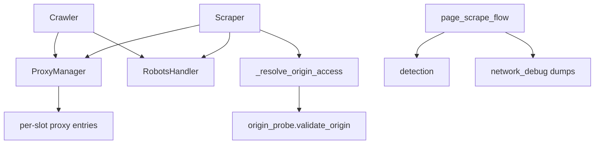
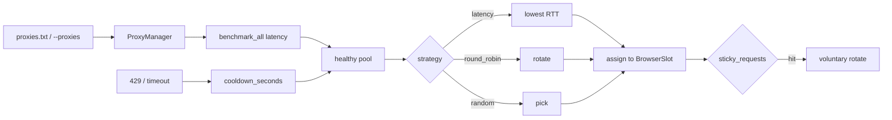
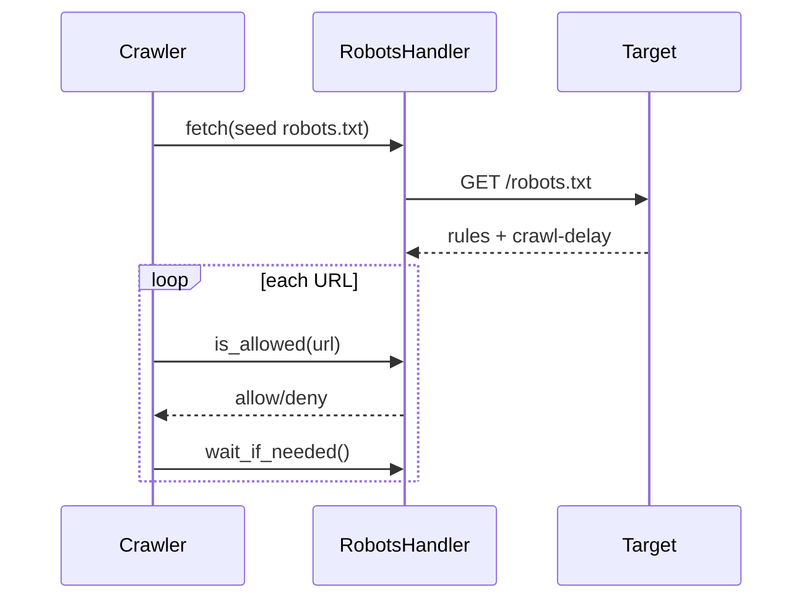
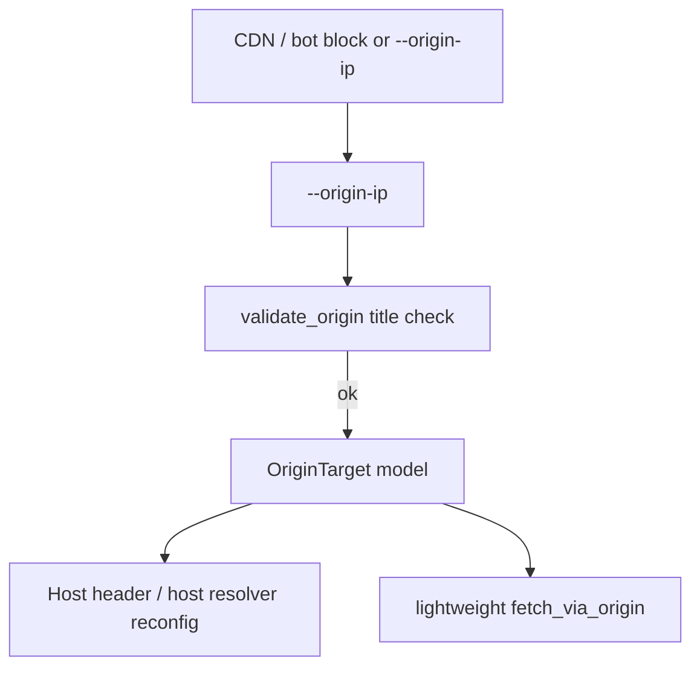

# Proxy, Robots & Origin Architecture

**Parent:** [Full System Architecture](../ARCHITECTURE.md)  
**Code:** `utils/proxy.py`, `utils/robots.py`, `utils/origin_probe.py`, `utils/detection.py`, `utils/network_debug.py`

---

## 1. Goals

- Route traffic through healthy proxies with strategy + cooldown.
- Obey robots.txt (unless explicitly disabled).
- Optionally scrape via **origin IP + Host header** when CDN edge blocks the browser (authorized use only — manual IP only).
- Persist network debug dumps on scrape failures for diagnosis.

---

## 2. Component diagram

---

## 3. Proxy architecture

**Auth interaction:** when authenticated / `--login`, voluntary rotate on slot 0 is suppressed (`auth_pin_proxy`). Forced rotate reinjects `storage_state` and may re-verify `--auth-check-url`.

---

## 4. Robots architecture

Flags:

- `--no-robots` — ignore entirely  
- `--ignore-crawl-delay` — keep allow/deny, skip delay  
- `--delay-min` / `--delay-max` — additional politeness jitter  

---

## 5. Origin path (manual IP only)

| Piece | Role |
|-------|------|
| `utils/origin_probe.py` | Title validation, origin HTTP fetch, Cloudflare IP filter |
| `models/origin.py` | `OriginTarget` dataclass |
| `BrowserManager.reconfigure_host_resolver` | Point hostname → origin IP in browser |

There is **no automatic origin discovery**. Operators must supply `--origin-ip` explicitly.

---

## 6. Network debug

On scrape failures or bot/challenge detection, `utils/network_debug.py` writes JSON summaries under `{output_dir}/_network_debug/`. Controlled by session config:

- `network_debug` (default `True`) — enable dumps on failures  
- `network_debug_always` (default `False`) — dump on every page  

---

## 7. Decision matrix

| Situation | Preferred action |
|-----------|------------------|
| Normal scrape | Direct or proxy via Patchright |
| Soft rate limit | Delay + sticky rotate |
| Hard bot wall | Stealth → proxy rotate → CAPTCHA |
| Authenticated crawl | Pin proxy; avoid voluntary rotate |
| Authorized origin recon | `--origin-ip` (manual only) |

---

## 8. Security / ethics note

Origin-IP scraping can violate target ToS and laws if unauthorized. Architecture supports this only as an **opt-in operator tool** with validation guards (`expected_title`) to reduce accidental misrouting.
