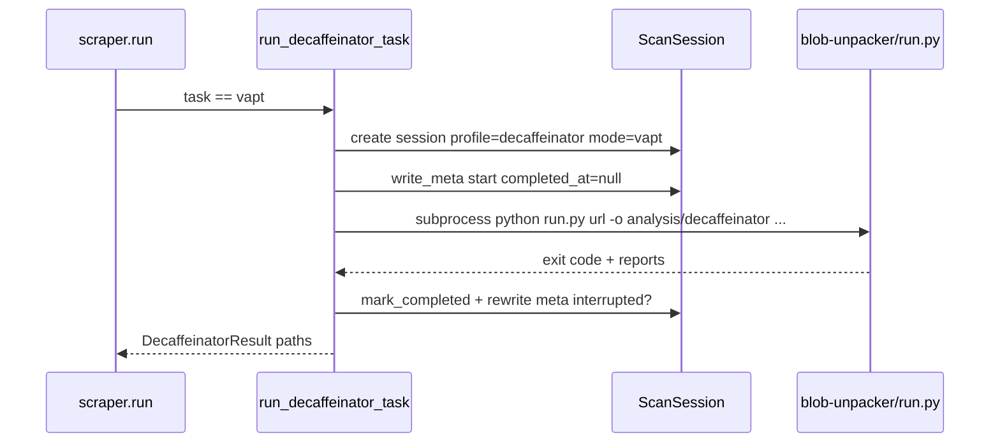

# VAPT / De-Caffeinator architecture

**Parent:** [ARCHITECTURE](../ARCHITECTURE.md) · [WORKFLOWS](../WORKFLOWS.md)  
**Code:** `webvac/vapt/decaffeinator.py` · submodule `decaffeinator/` → tool root `decaffeinator/blob-unpacker/`

---

## 1. Goals

- Offer an **opt-in** JavaScript reverse-engineering / unpack workflow without resurrecting the old in-tree VAPT analyzer stack.
- Reuse WebVac scan session layout so VAPT artifacts sit beside scrape history.
- Keep De-Caffeinator as a separate git submodule with its own Node/Python toolchain.

---

## 2. How `--task vapt` works



Important: VAPT **replaces** the scrape pipeline for that invocation. No Patchright crawl runs in the WebVac process.

---

## 3. Submodule layout

```text
.gitmodules
  [submodule "decaffeinator"]
    path = decaffeinator
    url  = https://github.com/Shellghostt/De-Caffeinator.git

decaffeinator/
  blob-unpacker/
    run.py          ← required entrypoint
    package.json    ← Node tooling (npx)
    ...
```

Default root resolution: `./decaffeinator/blob-unpacker` (override with `--decaffeinator-root`).

Clone tip:

```bash
git clone --recurse-submodules https://github.com/Shellghostt/WebVac.git
# or
git submodule update --init --recursive
```

---

## 4. Outputs

Under the normal scan session:

```text
.../scans/<session>/
  meta/meta.json
  meta/decaffeinator.json      # command, root, profile
  analysis/decaffeinator/
    run-report.json            # or <host>/run-report.json
    summary.md
    … tool-specific trees …
```

`meta.json` is written at start and again after the subprocess finishes with `completed_at` set and `interrupted=(returncode != 0)`.

---

## 5. Profiles & flags

| Flag | Meaning |
|------|---------|
| `--vapt-profile standard\|quick\|stealth\|deep` | Preset aggressiveness |
| `--vapt-format json\|jsonl` | Report format |
| `--vapt-playwright` | SPA asset discovery inside De-Caffeinator |
| `--vapt-wayback` | Historical JS via Wayback |
| `--vapt-no-files` | Skip writing deobfuscated sources |
| `--decaffeinator-root DIR` | Custom tool root |
| Shared | `--depth`, `--max-pages`, `--concurrency`, `--timeout`, `--delay-min`, `--no-headless` → `--pw-visible` |

Interactive menu: **VAPT / JS analysis** → `_build_vapt_cmd_args`.

---

## 6. Doctor checks (VAPT)

When `--task vapt` is selected, `--doctor` validates:

- De-Caffeinator root contains `run.py`
- `node` / `npx` available on PATH  
Browser launch may be skipped for non-Playwright VAPT profiles.

---

## 7. Related

- [SCAN_LAYOUT](../SCAN_LAYOUT.md)  
- [CLI](CLI.md)  
- De-Caffeinator upstream README inside the submodule  
