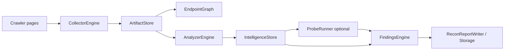
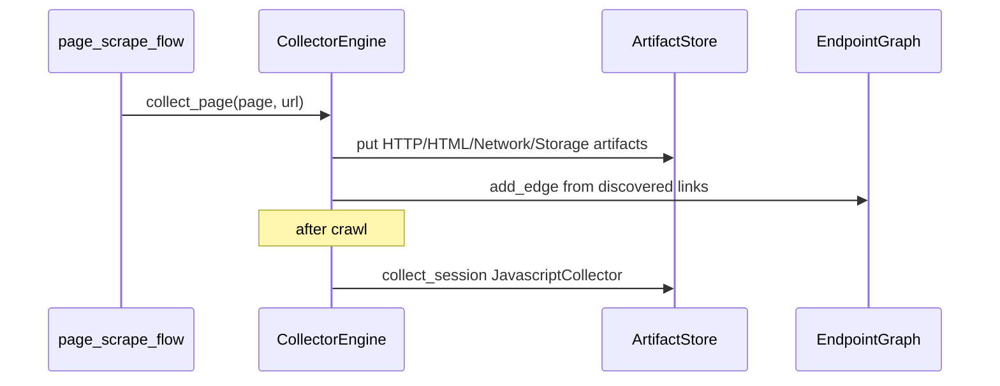
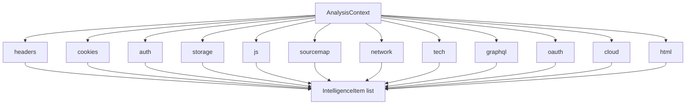
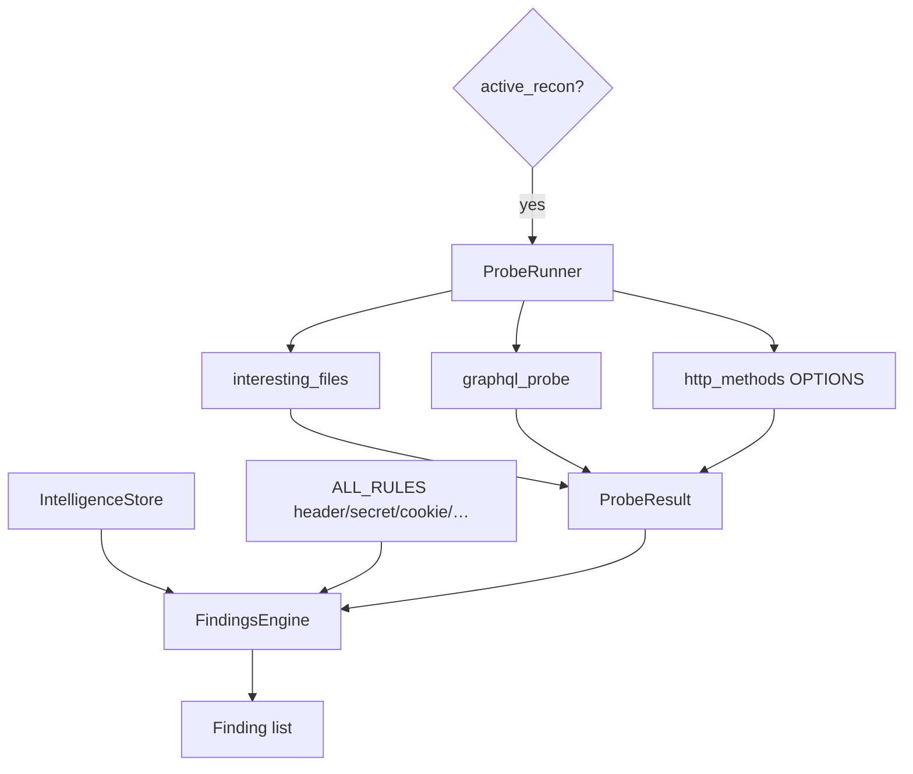
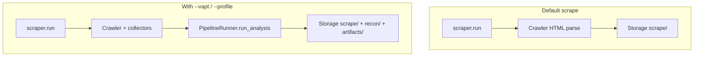

# VAPT / Recon Pipeline Architecture

**Parent:** [Full System Architecture](../ARCHITECTURE.md)  
**Status:** Implemented · **default OFF** (`vapt_enabled: False`) · enable with `--vapt` or `--profile {quick,standard,deep,bugbounty}`

**Code:** `collectors/`, `analyzers/`, `findings/`, `active/`, `intelligence/`, `graph/`, `core/runner.py`, `config/scan_profiles.py`, CLI in `cli/scraper.py`

---

## 1. Goals

When enabled, enrich a crawl with:

1. Structured **artifacts** per page/session  
2. **Intelligence** observations from analyzers  
3. Optional **active probes**  
4. Rule-based **findings** + recon reports  

Must never change default scrape behavior while disabled.

---

## 2. Pipeline overview



Orchestrator: `core/runner.py` → `PipelineRunner` (`run_analysis`, `persist_session`, `from_profile`).

---

## 3. Collectors

Plugin discovery via `collectors/plugins.py` → `CollectorEngine`.

| Collector | Level | Captures |
|-----------|-------|----------|
| `HttpCollector` | page | Status, headers, redirects |
| `HtmlCollector` | page | DOM, forms, links → graph edges |
| `NetworkCollector` | page (live attach) | XHR/fetch traffic |
| `StorageCollector` | page | Cookies, local/sessionStorage |
| `JavascriptCollector` | **session** | External JS + source maps |



---

## 4. Analyzers

`AnalyzerEngine.run(AnalysisContext)` with `ctx.is_analyzer_enabled(name)`.



**HTML analyzer:** forms, hidden inputs, file uploads, interesting comments, admin/auth links.

**Auth analyzer note:** default-credential panel fingerprints always available when auth analyzer enabled; **cookie-flag findings** additionally require `vapt_enabled` (scrape-safe login warnings live in `auth/cookie_audit.py` instead).

---

## 5. Findings & active probes



Rules modules under `findings/rules/`: header, secret, cookie, storage, network, cloud, auth, infra.

**Not implemented:** `api_fuzzer` (mentioned in older design notes only).

---

## 6. Profiles

`config/scan_profiles.py` presets: `quick`, `standard`, `deep`, `bugbounty`.

```bash
python -m webvac --url https://example.com --mode crawl --profile standard
python -m webvac --url https://example.com --mode single --vapt
python -m webvac --url https://example.com --mode crawl --profile deep   # includes active recon
python -m webvac --url https://example.com --mode crawl --vapt --active-recon
```

`--profile` / `--active-recon` imply VAPT. Default scrape path stays unchanged without these flags.

---

## 7. Scrape path with optional VAPT



| Concern | Today |
|---------|-------|
| `vapt_enabled` default | `False` |
| Enable | `--vapt`, `--profile`, or `--active-recon` |
| Collectors during crawl | When `vapt_enabled` |
| `PipelineRunner` after crawl | Called from `cli/scraper.py` |
| Recon HTML/JSON reports | Via `Storage.save(..., recon=)` |

---

## 8. Shared stores

| Store | Role |
|-------|------|
| `ArtifactStore` | Typed raw evidence |
| `IntelligenceStore` | Deduped observations |
| `EndpointGraph` | URL/endpoint tree |
| `ScopeManager` | Scope + visit stats for recon context |

`AnalysisContext` bundles these for every analyzer call.
